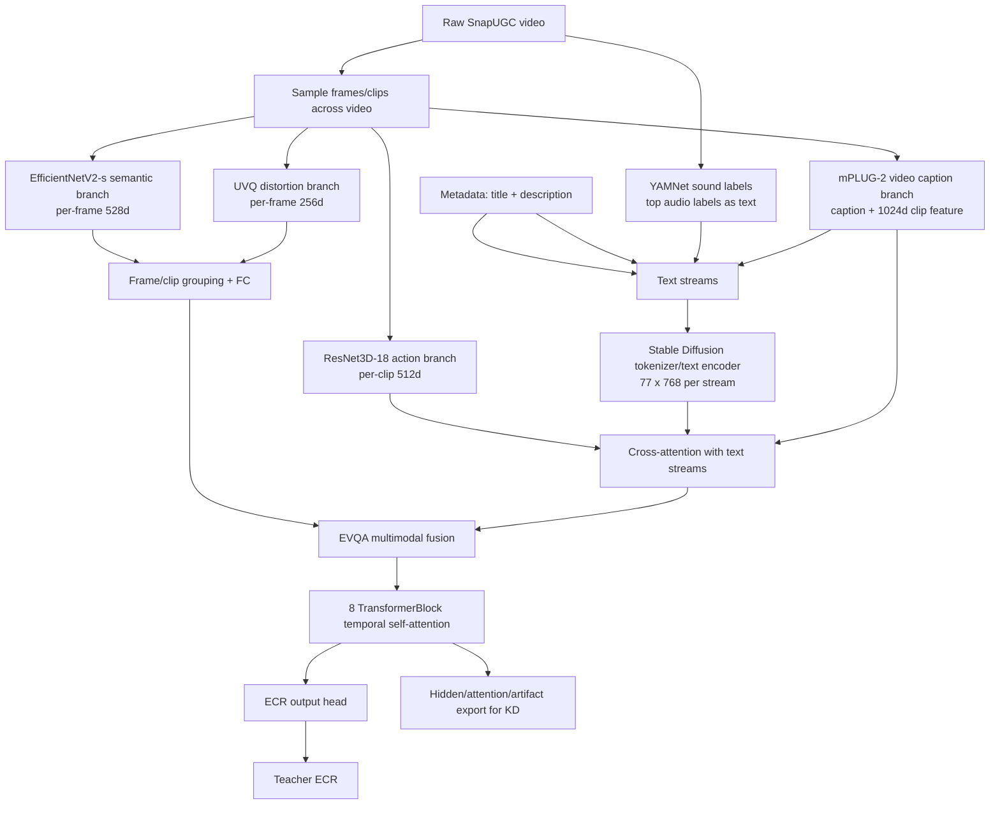
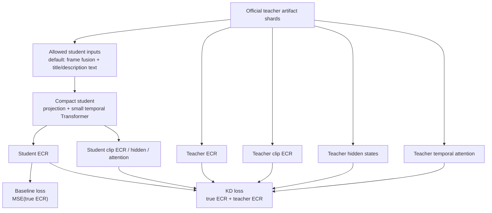
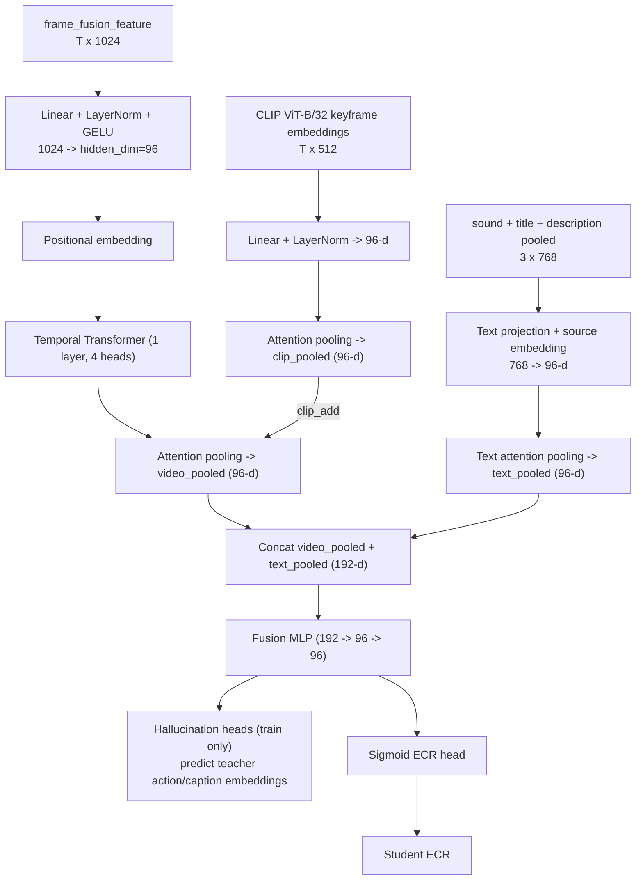

# SnapUGC-LightKD

Thesis code for a bounded 5000-video SnapUGC knowledge-distillation study.

The current main experiment uses the authors' released SnapUGC EVQA teacher
from `dasongli1/SnapUGC_Engagement` on one fixed, balanced 5000-video subset.
Local code prepares the subset, runs/monitors the official teacher on GCloud,
exports teacher artifacts for KD, and keeps student/baseline experiments
separate from the teacher reproduction.

## Current Pipeline

```text
Balanced 5000-video subset
  -> official SnapUGC EVQA teacher inference on GCloud L4
     - EfficientNetV2-s semantic frame features
     - UVQ-style distortion features
     - ResNet3D-18 action features
     - mPLUG-2 caption and clip features
     - YAMNet sound labels
     - Stable Diffusion text encoder
     - EVQA.pth ECR head
  -> scalar teacher ECR + hidden/attention/artifact shards
  -> lightweight student baseline and KD experiments
```

The official teacher architecture is not reimplemented in
`src/snapugc_lightkd/models.py`. A pinned local copy of the real teacher source
lives in `third_party/SnapUGC_Engagement/ECR_inference/`. Runtime code patches
a working copy only for compatibility/artifact export. See
`docs/original_snapugc_exact_reproduction.md` for file-level architecture
details, and `docs/gcp_official_inference_artifacts_readme.md` for the concrete
Google Cloud runbook used to run official inference and export teacher artifact
shards.

## Dataset And Split

The thesis uses one locked balanced 5000-video subset:

```text
data/train_subset_balanced_5000.csv
data/official_balanced_5000_videos/
data/official_5k_split/
```

The zip archive below contains the 5000 videos, labels, and fixed split files:

```text
data/official_snapugc_5k_locked_dataset.zip
```

Student experiments use a deterministic `4000/1000` split:

```text
seed = 42
val_ratio = 0.2
rows = official teacher artifact rows sorted by order_idx
test/val = first 1000 indices after np.random.default_rng(42).shuffle(...)
train = remaining 4000 rows
```

Split files:

```text
data/official_5k_split/train_4000.csv
data/official_5k_split/test_1000.csv
data/official_5k_split/split_all_5000.csv
data/official_5k_split/manifest.json
```

In the code, the 1000 held-out rows are named `val` because they are used for
model selection. In thesis writing, call them a fixed validation/test split and
state the split protocol clearly.

## Repository Structure

```text
SnapUGC-LightKD/
  data/                    # local 5k subset/videos; ignored by git
  docs/                    # reproduction notes and locked result summaries
  notebooks/               # official Kaggle notebook kept for reproducibility
  results/                 # generated reports/checkpoints; ignored by git
  scripts/
    extract_clip_keyframe_features.py   # extract CLIP ViT-B/32 keyframe embeddings from video tar
    train_official_student_kd.py        # student baseline and KD training
    evaluate_student_ensemble.py        # ensemble evaluation over multiple checkpoints
    run_official_snapugc_evqa.py        # official teacher inference wrapper
    make_subset.py                      # create balanced 5k video subset
  src/snapugc_lightkd/     # student artifact dataset/model helpers
  third_party/             # pinned official teacher source, no checkpoints
```

## Setup

```bash
python3 -m venv .venv
source .venv/bin/activate
pip install -U pip
pip install -e .
```

On GCloud/L4, install the CUDA-compatible PyTorch wheel before running the
official teacher wrapper.

## Model Inputs And Outputs

This project has three model roles:

```text
1. Official teacher
   Input: raw video + title + description
   Output: teacher ECR plus artifact shards for KD

2. Student baseline
   Input: reduced teacher-extracted artifacts only
   Output: student ECR
   Loss: ground-truth ECR only

3. Student KD
   Input: exactly the same reduced inputs as student baseline
   Output: student ECR plus auxiliary student artifacts
   Loss: ground-truth ECR + teacher ECR/artifact/ranking distillation
```

The deployable student never sees the full privileged teacher input stack at
inference time. The retained deployable preset is `visual_text_sound` with
an optional CLIP semantic branch (best configuration):

```text
Student input preset: visual_text_sound
- frame_fusion_feature: T x 1024          (EfficientNetV2-s + UVQ, from teacher artifacts)
- YAMNet top sound labels text emb: 1 x 768
- title pooled text embedding:     1 x 768
- description pooled text emb:     1 x 768

[Optional, deployable] CLIP ViT-B/32 keyframe embeddings:
- quality_features: T x 512               (CLIP image encoder on 16 uniform keyframes)
- quality_fusion: clip_add                (added into hidden space after temporal encoder)
```

Learned source/type embeddings distinguish sound labels, title, and description
before text pooling. The `clip_add` fusion adds CLIP embeddings into the
hidden representation after temporal encoding — acting as late semantic gating.

The teacher artifacts available for KD are:

```text
teacher_ecr: scalar
teacher_clip_ecr: T
teacher_temporal_hidden: T x 512
teacher_fusion_hidden: T x 512
teacher_attention_importance: attention_layers x T
```

## Official Teacher Run

The primary GCloud runner is:

```bash
SHUTDOWN_ON_EXIT=1 \
ROOT_DIR=/workspace/SnapUGC-LightKD \
SUBSET_CSV=/workspace/snapugc-data/train_subset_balanced_5000.csv \
VIDEO_DIR=/workspace/snapugc-data/train_videos_balanced_5000 \
OUT_DIR=/workspace/results/original_snapugc_official_balanced_5000_artifacts_g2_32 \
CHECKPOINT_DIR=/workspace/snapugc-checkpoints \
EXPORT_ARTIFACTS=1 \
ARTIFACT_SHARD_SIZE=25 \
bash scripts/run_gcp_official_balanced_5k_from_links.sh
```

The run writes partial reports every 500 predictions and artifact shards every
25 videos:

```text
official_partial_500_predictions.csv
official_partial_500_report.json
teacher_artifacts/official_teacher_artifacts_0000_0024.npz
teacher_artifacts/official_teacher_artifacts_0000_0024_captions.jsonl
```

Sync outputs back to local:

```bash
PROJECT=snapugc-lightkd \
ZONE=asia-southeast1-a \
INSTANCE=snapugc-l4-artifacts \
REMOTE_OUT_DIR=/workspace/results/original_snapugc_official_balanced_5000_artifacts_g2_32 \
LOCAL_OUT_DIR=results/original_snapugc_official_balanced_5000_artifacts_g2_32 \
bash scripts/sync_gcp_official_5k_outputs.sh
```

## Official Teacher Architecture

The teacher is the released SnapUGC EVQA inference stack from the original
authors. It is heavyweight because it combines multiple pretrained components:



Teacher output files:

```text
official_submission_baseline.csv      # Id, ECR prediction
official_evqa_report.json             # PLCC, SRCC, final score, MSE, MAE
teacher_artifacts/*.npz               # hidden states, clip outputs, attention
teacher_artifacts/*_captions.jsonl    # generated captions
```

The official teacher is inference-only in this thesis: we use the released
checkpoints and do not retrain the original teacher.

## Student Work

Student baseline and KD are implemented separately from the official teacher.
They train from synced teacher artifact shards using reduced student inputs.



### Student Architecture (Best Single Model)

The best deployable student adds CLIP ViT-B/32 keyframe embeddings via `clip_add`
fusion into the hidden space after temporal encoding:



Hyperparameters (tuned compact student):

```text
hidden_dim = 96
Transformer layers = 1
heads = 4
dropout = 0.25
max_clips = 16
quality_fusion = clip_add    # key: add CLIP into hidden, not input concat
```

Baseline training objective:

```text
loss_baseline = MSE(student_ecr, true_ecr)
```

### Student KD Architecture And Loss

The KD student uses the same input and architecture as its baseline counterpart.
It adds auxiliary heads/projections only during training:

```text
student_clip_ecr: per-clip scalar predictions
project(student_temporal): T x 512 teacher-space tokens
project(student_hidden): 512 teacher-space pooled hidden state
student_temporal_attention: T
```

KD objective:

```text
loss_kd =
  hard_ecr      * MSE(student_ecr, true_ecr)
+ soft_ecr      * MSE(student_ecr, teacher_ecr)
+ clip_ecr      * MSE(student_clip_ecr, teacher_clip_ecr)
+ temporal      * repr_loss(project(student_temporal), teacher_temporal_hidden)
+ fusion        * repr_loss(project(student_hidden), mean(teacher_fusion_hidden))
+ attention     * KL(student_temporal_attention, teacher_attention_importance)
+ hard_rank     * pairwise_rank(student_ecr, true_ecr)
+ teacher_rank  * pairwise_rank(student_ecr, teacher_ecr)
+ hallucination * repr_loss(hallucinated_features, teacher_privileged_features)
```

### Scientific Loss Functions & Published Papers

To maximize the transfer of complex multimodal reasoning, our KD architecture integrates 6 advanced loss functions inspired by key scientific publications:

1. **Classic Logit KD & Soft Targets** (Hinton et al., NeurIPS 2015)
   * *Loss term*: `soft_ecr` and `clip_ecr`.
   * *Concept*: Distills the continuous soft predictions (logits) of the Teacher, transferring the "dark knowledge" and absolute rating values of the video quality to the Student.
   * *Paper*: *Distilling the Knowledge in a Neural Network*.

2. **FitNets Feature Alignment** (Romero et al., ICLR 2015)
   * *Loss term*: `temporal` and `fusion`.
   * *Concept*: Aligns intermediate hidden states. Since the Student dimension ($96$) is smaller than the Teacher ($512$), a linear projection head projects the student features into the teacher's space before calculating `cosine` representation loss.
   * *Paper*: *FitNets: Hints for Thin Deep Nets*.

3. **Attention Transfer (AT)** (Zagoruyko & Komodakis, ICLR 2017)
   * *Loss term*: `attention`.
   * *Concept*: Forces the Student's temporal attention weights to copy the Teacher's multi-head attention weights via KL Divergence, ensuring the student focuses on the same keyframes.
   * *Paper*: *Paying More Attention to Attention: Improving the Performance of Convolutional Neural Networks via Attention Transfer*.

4. **Relational KD (RKD)** (Park et al., CVPR 2019)
   * *Loss term*: `rkd_distance` and `student_teacher_relation`.
   * *Concept*: Minimizes L2 distance relations between pairs of samples, allowing the student to learn relational metrics.
   * *Paper*: *Relational Knowledge Distillation*.

5. **Contrastive Representation Distillation (CRD)** (Tian et al., ICLR 2020)
   * *Loss term*: `contrastive_hidden`.
   * *Concept*: Maximizes the mutual information between student and teacher representations via contrastive InfoNCE loss.
   * *Paper*: *Contrastive Representation Distillation*.

6. **Privileged Information & Hallucination Network** (Vapnik et al. 2015, Hoffman et al. CVPR 2016)
   * *Loss term*: `action_hallucination` and `caption_hallucination`.
   * *Concept*: During training, the Student uses auxiliary heads to predict the Teacher's private modalities (e.g. 3D ResNet action features, mPLUG-2 captions) from public inputs. These heads are discarded at inference, enabling deployability.
   * *Paper*: *Learning with Privileged Information: A New Paradigm* & *Cross Modal Distillation for Supervision Transfer*.

### Loss Function Ablation Study

To systematically evaluate the contribution of each layer of our knowledge distillation pipeline, we perform an ablation study on the validation split. By incrementally adding the different loss terms (Tiers of KD), we observe clear and cumulative performance gains:

| Tier | Loss Terms Included | Scientific Reference Mapping | Validation Final Score | Marginal Gain |
| :--- | :--- | :--- | :---: | :---: |
| **0. Baseline (No KD)** | `hard_ecr` | Standard regression baseline | **0.5243** | — |
| **1. Logit KD** | `hard_ecr` + `soft_ecr` + `clip_ecr` | Hinton et al. (NeurIPS 2015) | **0.5732** | `+0.0489` |
| **2. Feature & Attn KD** | Tier 1 + `temporal` + `fusion` + `attention` | Romero et al. (FitNets), Zagoruyko et al. (AT) | **0.6027** | `+0.0295` |
| **3. Ranking KD** | Tier 2 + `hard_rank` + `teacher_rank` | Pairwise ranking loss | **0.6127** | `+0.0100` |
| **4. Full Student KD** | Tier 3 + `action_halluc_loss` + `caption_halluc_loss` | Vapnik et al. (LUPI), Hoffman et al. | **0.6285** | `+0.0158` |

**Key Takeaways for Thesis Writing**:
- **Logit matching (Tier 1)** contributes the single largest individual performance leap (`+0.0489`), demonstrating the crucial value of the teacher's continuous predictions (soft targets) compared to hard ground-truth labels.
- **Intermediate features & attention alignment (Tier 2)** adds an extra `+0.0295` by forcing the student to learn *how* the teacher represents video dynamics and *where* it focuses.
- **Privileged feature hallucination (Tier 4)** successfully breaks the input information bottleneck by reconstructing the teacher's heavy features (action & captions) only during training, giving an extra `+0.0158` without adding any runtime computing cost during production.

`repr_loss` supports raw MSE, normalized MSE, and cosine distance. The tuned model uses cosine representation KD because raw hidden-state MSE was too large in scale and dominated scalar ECR/ranking losses.

### Best Training Command (CLIP clip_add + Curriculum + Hallucination)

Step 1 — Extract CLIP ViT-B/32 keyframe features from the video archive:

```bash
python scripts/extract_clip_keyframe_features.py \
  --tar results/videos_5000.tar \
  --labels-csv data/train_subset_balanced_5000.csv \
  --out results/clip_vitb32_keyframe_features_5000.npz \
  --model ViT-B-32 --pretrained openai \
  --n-frames 16 --device mps
```

Step 2 — Train the student with CLIP `clip_add` fusion:

```bash
python scripts/train_official_student_kd.py \
  --artifact-dir results/original_snapugc_official_balanced_5000_artifacts_g2_32/teacher_artifacts \
  --labels-csv data/train_subset_balanced_5000.csv \
  --save-dir results/kd_tuning_official_5k/improve_clip_vitb32_clipadd_curriculum_halluc \
  --input-preset visual_text_sound \
  --quality-features results/clip_vitb32_keyframe_features_5000.npz \
  --quality-fusion clip_add \
  --use-hallucination --hallucination-feedback --feedback-start-epoch 10 \
  --hidden-dim 96 --layers 1 --heads 4 \
  --dropout 0.25 --epochs 100 --batch 32 --eval-batch 128 \
  --lr 5e-4 --weight-decay 0.02 \
  --val-ratio 0.2 --seed 42 --device mps --run-kind kd \
  --kd-curriculum three_phase \
  --soft-weight 1.1 --clip-weight 0.08 \
  --temporal-weight 0.02 --fusion-weight 0.02 --attention-weight 0.005 \
  --hard-rank-weight 0.04 \
  --teacher-rank-weight 0.18 --teacher-pearson-weight 0.02 \
  --teacher-spearman-weight 0.015 --teacher-listwise-weight 0.02 \
  --student-teacher-relation-weight 0.02 --contrastive-hidden-weight 0.02 \
  --action-hallucination-weight 0.03 --caption-hallucination-weight 0.05
```

See `docs/student_kd_architecture.md` for the full student KD diagram,
input presets, loss terms, and ablation results.

The report metric is `final_score = 0.6 * SRCC + 0.4 * PLCC`.

## Retained 5k Results

All retained runs live under `results/kd_tuning_official_5k/`.

| Run | Input | PLCC | SRCC | Final | Note |
|---|---|---:|---:|---:|---|
| `Official Teacher (Upper Bound)` | raw video + title + description | - | - | **0.7038** | Heavyweight upper bound teacher model |
| `Best Single Model (KD)` (`improve_clip_vitb32_clipadd_curriculum_halluc`) | `visual_text_sound` + CLIP B/32 | 0.6325 | 0.6259 | **0.6285** | Best deployable student (KD + CLIP + Curriculum + Halluc) |
| `Baseline with CLIP (No KD)` (`baseline_clip_vitb32_clipadd`) | `visual_text_sound` + CLIP B/32 | 0.5629 | 0.5569 | **0.5593** | Fair baseline with CLIP trained without KD |
| `Visual Text Sound (KD)` (`v35_concat_source_embed_v22loss`) | `visual_text_sound` | 0.6070 | 0.5999 | **0.6027** | Base deployable student trained with KD |
| `Baseline (No KD)` | `visual_text_sound` | - | - | **0.5243** | Base student trained without KD (hard ECR loss only) |
