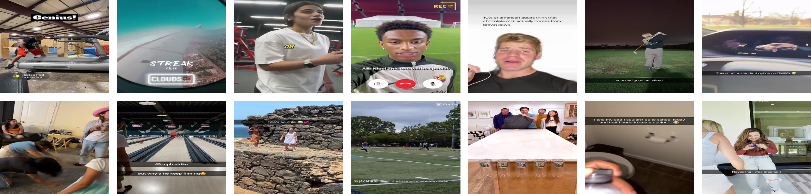
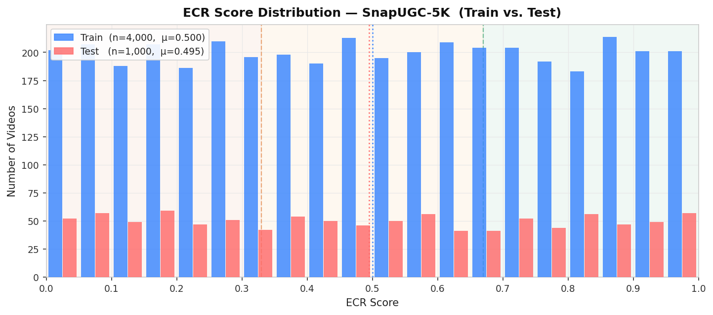
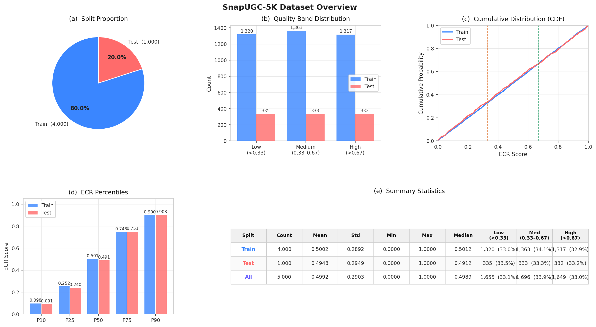
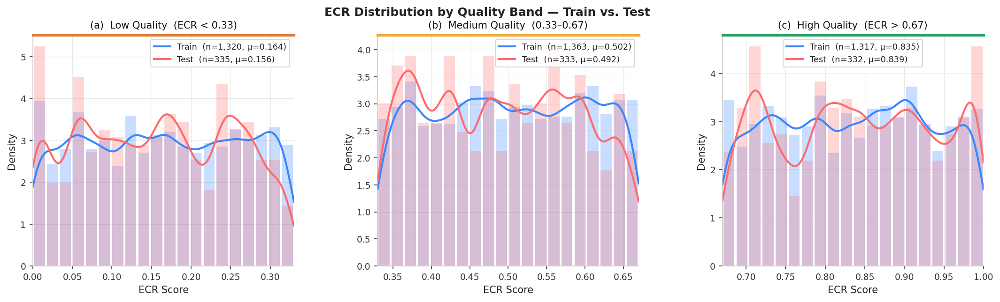
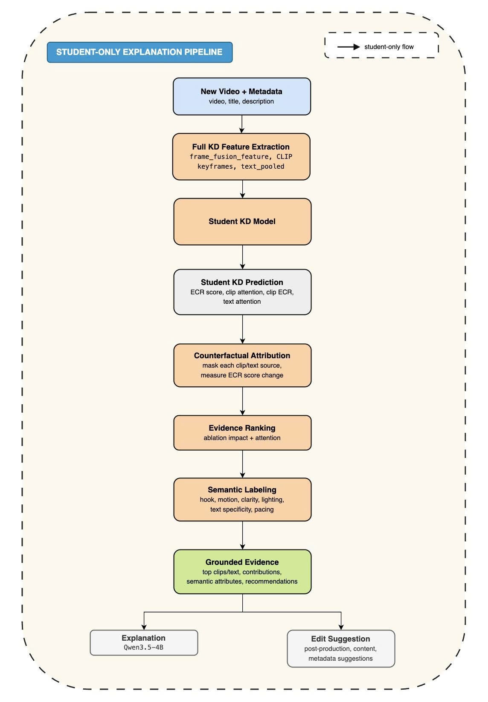
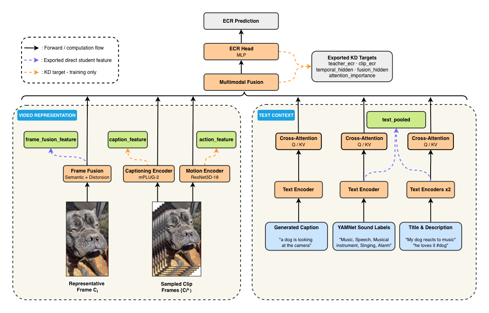
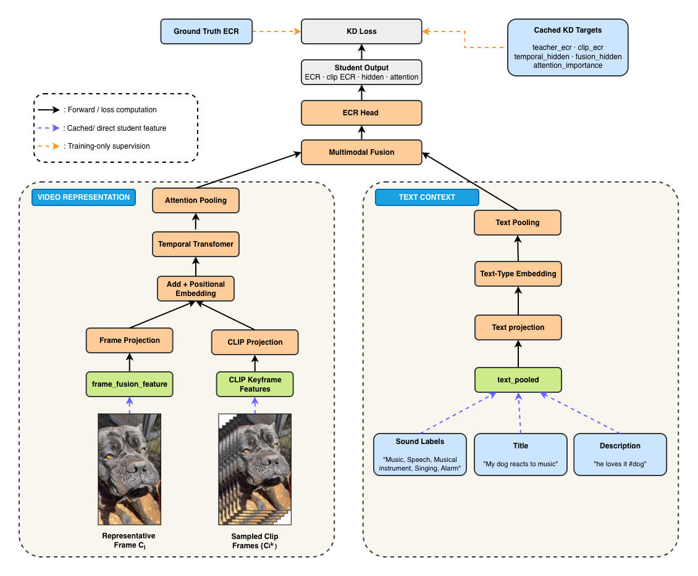
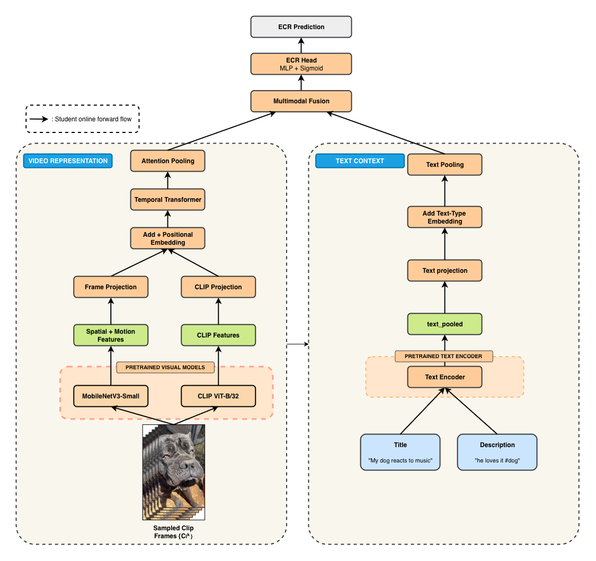

# SnapUGC-LightKD

Thesis code for a bounded 5000-video SnapUGC knowledge-distillation study.

The current main experiment uses the authors' released SnapUGC EVQA teacher
from `dasongli1/SnapUGC_Engagement` on one fixed, balanced 5000-video subset.
Local code prepares the subset, runs/monitors the official teacher on GCloud,
exports teacher artifacts for KD, and keeps student/baseline experiments
separate from the teacher reproduction.

## Current Pipeline

```text
Balanced 5000-video subset
  -> official SnapUGC EVQA teacher inference on GCloud L4
     - EfficientNetV2-s semantic frame features
     - UVQ-style distortion features
     - ResNet3D-18 action features
     - mPLUG-2 caption and clip features
     - YAMNet sound labels
     - Stable Diffusion text encoder
     - EVQA.pth ECR head
  -> scalar teacher ECR + hidden/attention/artifact shards
  -> lightweight student baseline and KD experiments
```

The online demo is a separate teacher-free path:

```text
new video + title + description
  -> CLIP ViT-B/32 + MobileNetV3-Small + Stable Diffusion text encoder
  -> Proper KD student checkpoint
  -> predicted ECR + grounded explanation + editable suggestions
  -> optional bounded auto-edit and student rerun
```

The official teacher architecture is not reimplemented in
`src/snapugc_lightkd/official_student.py`. A pinned local copy of the real teacher source
lives in `third_party/SnapUGC_Engagement/ECR_inference/`. Runtime code patches
a working copy only for compatibility/artifact export. See
`docs/original_snapugc_exact_reproduction.md` for file-level architecture
details, and `docs/gcp_official_inference_artifacts_readme.md` for the concrete
Google Cloud runbook used to run official inference and export teacher artifact
shards.

## Dataset And Split

The thesis uses one locked balanced 5000-video subset:

```text
data/train_subset_balanced_5000.csv
data/official_balanced_5000_videos/
data/official_5k_split/
```

The zip archive below contains the 5000 videos, labels, and fixed split files:

```text
data/official_snapugc_5k_locked_dataset.zip
```

Dataset 5k and student checkpoint folder: [Google Drive](https://drive.google.com/drive/folders/1cwknHCOV5NTM1QhCx-QLv7LwDOZnkaHA)

Student-training artifacts (precomputed teacher targets and feature caches): [Google Drive](https://drive.google.com/drive/folders/1eYkGtT1Vi6sQintNkEXi0xgAKZEWxXRu?usp=drive_link)

The final student protocol uses a deterministic `4000/500/500` split:

```text
split seed = 20260706
train = 4000 videos
validation = 500 videos for checkpoint selection
locked student test = 500 videos for final reporting
```

Split files:

```text
data/official_5k_split_4000_500_500/train_ids.txt
data/official_5k_split_4000_500_500/val_ids.txt
data/official_5k_split_4000_500_500/test_ids.txt
data/official_5k_split_4000_500_500/manifest.json
```

Teacher artifacts were precomputed independently for all 5000 videos. The
locked test is held out only from student training and model selection; it is
not teacher-held-out or cross-domain.

To retrain a student without rerunning the teacher, download the artifact
folder and place its contents at these paths:

```text
results/original_snapugc_official_balanced_5000_artifacts_g2_32/teacher_artifacts/
results/clip_vitb32_keyframe_features_5000.npz
results/lite_action_features_5000.npz
data/train_subset_balanced_5000.csv
```

The artifact folder is required for all student training. The CLIP cache is
required for the semi-independent Full KD preset, while the MobileNet cache is
also required for Proper KD. Raw videos and teacher checkpoints are not needed
when training from these precomputed artifacts.

### Dataset Visualizations

* **Dataset Samples**: A grid of sample video frame thumbnails from the SnapUGC dataset with their corresponding ECR quality scores overlayed:

  

* **ECR Score Distribution**: The distribution of Engagement Continuation Ratio (ECR) scores across the balanced 5000-video subset, comparing the train and validation splits:

  

* **Dataset Overview & Statistics**: Analysis of ECR quality band bar chart, Cumulative Distribution Function (CDF), percentile stats, and metadata counts:

  

* **ECR Quality Bands Detail**: Per-band score distribution comparison across low, medium, and high quality regions:

  

## Repository Structure

```text
SnapUGC-LightKD/
  data/                    # local 5k subset/videos; ignored by git
  docs/                    # reproduction notes and locked result summaries
  notebooks/               # official Kaggle notebook kept for reproducibility
  results/                 # generated reports/checkpoints; ignored by git
  scripts/
    extract_clip_keyframe_features.py   # extract CLIP ViT-B/32 keyframe embeddings from video tar
    train_official_student_kd.py        # student baseline and KD training
    evaluate_student_ensemble.py        # ensemble evaluation over multiple checkpoints
    run_official_snapugc_evqa.py        # official teacher inference wrapper
    infer_new_video_with_student_expl.py # Proper KD prediction and grounded explanation
    run_demo_proper_kd_local_llm.sh      # local UI launcher (default port 7861)
    run_proper_kd_auto_edit_batch.py     # batch analyze/edit/rerun workflow
    make_subset.py                      # create balanced 5k video subset
  src/snapugc_lightkd/     # student artifact dataset/model helpers
  third_party/             # pinned official teacher source, no checkpoints
```

## Setup

```bash
python3 -m venv .venv
source .venv/bin/activate
pip install -U pip
pip install -e .
```

On GCloud/L4, install the CUDA-compatible PyTorch wheel before running the
official teacher wrapper.

## Explain Demo

The current UI is a teacher-free Proper KD demo for new videos. It uses the
`clip_mobilenet_text` checkpoint (`hidden_dim=192`, 2 Transformer layers) and
reconstructs every online student input from the uploaded video and metadata:

```text
video -> at most 16 uniformly sampled clips
      -> CLIP ViT-B/32 image embedding (512-D)
      +  MobileNetV3-Small spatial-motion vector (1152-D)
      -> T x 1664 visual student input

title + description
      -> Stable Diffusion CLIP text encoder with mean-token pooling
      -> 3 x 768 checkpoint-compatible text input
```

The three text positions retain the training-time `sound/title/description`
order. The current demo has no lightweight audio labeler, so `sound` is an
empty placeholder. Empty sources are kept in the model tensor for checkpoint
compatibility but are excluded from explanation ablation, ranking, and display.
The teacher, EfficientNetV2-S, teacher artifacts, and KD losses are not called
during demo inference.

The attribution and evidence-ranking stages are shared with the Full KD
explanation path. The figure below shows the Full KD variant, where a new video
first recreates `frame_fusion_feature`, CLIP keyframes, and `text_pooled`. The
current teacher-free UI replaces that first extraction block with the Proper KD
CLIP + MobileNet frontend; the subsequent student prediction, ablation,
evidence ranking, semantic labeling, and grounded verbalization stages remain
the same.



The default report and checkpoint are:

```text
results/final_4000_500_500_2026/proper_kd_seed42/official_student_kd_report.json
results/final_4000_500_500_2026/proper_kd_seed42/student_kd_best.pth
```

Student checkpoint folder: [Google Drive](https://drive.google.com/drive/folders/1cwknHCOV5NTM1QhCx-QLv7LwDOZnkaHA)

### Student-Only New-Video Explanation

```bash
python scripts/infer_new_video_with_student_expl.py \
  --video /path/to/new_video.mp4 \
  --title "Short, specific title" \
  --description "Optional context" \
  --report-json results/final_4000_500_500_2026/proper_kd_seed42/official_student_kd_report.json \
  --checkpoint results/final_4000_500_500_2026/proper_kd_seed42/student_kd_best.pth \
  --labels-csv data/official_5k_split/split_all_5000.csv \
  --input-preset clip_mobilenet_text \
  --out-json results/demo_runs/example/result.json \
  --assets-dir results/demo_runs/example/assets
```

The explanation flow is:

```text
student outputs: ECR, clip attention, clip ECR, text attention
  -> zero each clip and each non-empty text source; measure student ECR change
  -> rank evidence by ablation impact + student attention
  -> attach deterministic motion, lighting, clarity, hook, text, and pacing labels
  -> build a grounded structured evidence package
  -> constrained local/API LLM verbalization or deterministic template fallback
  -> explanation + publishable title/description + editing recommendations
```

The generated JSON includes the raw checkpoint ECR, empirical engagement band,
ranked clips and thumbnails, non-empty text evidence, semantic attributes,
natural-language explanation, and recommendations split into immediately
feasible post-production changes versus content/reshoot changes. The LLM only
rewrites the structured evidence package; a grounding guard removes unsupported
claims and falls back to a deterministic template when generation fails. This
is post-hoc attribution and constrained verbalization, not a formal causal
faithfulness guarantee.

### Demo UI

Install and start the local UI:

```bash
python -m pip install -r requirements.txt -r requirements-demo.txt
brew install ffmpeg  # macOS; otherwise install ffmpeg with the system package manager
```

For the local Qwen3.5-4B verbalizer, also install its isolated runtime:

```bash
python -m pip install -r requirements-local-llm.txt
```

This optional file pins the tested Transformers revision required by Qwen3.5.
Leaving it out keeps the core environment compatible with the older
official-model notebooks and still allows OpenAI API or template explanations.

Generated reports and checkpoints under `results/` are intentionally not
tracked by Git. The default launcher uses the locked Proper KD run above. Set
`SNAPUGC_REPORT_JSON` and `SNAPUGC_STUDENT_CHECKPOINT` when using a different,
compatible report/checkpoint pair. The preparation step can copy
`~/Downloads/student_kd_best.pth` into the selected checkpoint path, but the
corresponding report JSON must already exist.

```bash
# First run: verify/copy the checkpoint and cache the visual/text encoders and LLM.

SNAPUGC_PREPARE_PROPER_KD=1 \
SNAPUGC_PREPARE_LOCAL_LLM=1 \
bash scripts/run_demo_proper_kd_local_llm.sh
```

For later runs:

```bash
bash scripts/run_demo_proper_kd_local_llm.sh
```

Open `http://127.0.0.1:7861`. Override the port with
`SNAPUGC_DEMO_PORT=<port>`. The launcher defaults to `auto` mode with the local
`Qwen/Qwen3.5-4B` verbalizer in non-thinking mode. The explanation backend is
selected in this order: cached local Qwen, OpenAI-compatible API when an API
key is configured, then the deterministic grounded template. To run without an
LLM, use:

```bash
SNAPUGC_LLM_BACKEND=template bash scripts/run_demo_proper_kd_local_llm.sh
```

Optional OpenAI API fallback configuration:

```bash
export OPENAI_API_KEY="..."
export SNAPUGC_LLM_MODEL="gpt-4o-mini"
bash scripts/run_demo_proper_kd_local_llm.sh
```

With the default `auto` backend, these variables are used only when local Qwen
is unavailable or inference fails. Set `SNAPUGC_LLM_FALLBACK_TO_OPENAI=0` with
`SNAPUGC_LLM_BACKEND=local` to disable that fallback. To force the OpenAI API
instead of trying local Qwen first, create a local configuration file:

```bash
cp .env.example .env
# Edit .env and set OPENAI_API_KEY.
bash scripts/run_demo_proper_kd_local_llm.sh
```

The launcher automatically exports variables from `.env`; it is ignored by
Git. Set `SNAPUGC_LLM_BACKEND=openai`, `SNAPUGC_LLM_BASE_URL`, and
`SNAPUGC_LLM_MODEL` there to select the remote endpoint and model.

The UI displays model/checkpoint and LLM health, prediction and band, top clip
evidence, semantic attributes, grouped recommendations, and editable suggested
title/description fields. Suggested metadata is publishable text, while the
diagnostic rationale stays in separate recommendation fields.

`Chỉnh video` applies bounded brightness, contrast, sharpness, or saturation
changes only to non-top-evidence clips, preserves the original timeline and
audio, applies the user-editable metadata suggestion, reruns the same student,
and reports before/after predicted ECR. `ffmpeg` is required for audio
preservation; the operation fails instead of silently returning a muted video.
The editor never invents scenes, actions, or objects.

Inference is fail-closed: the UI and CLI refuse to run if the report is missing,
the checkpoint is missing, or its state dictionary is incomplete/incompatible.

## Model Inputs And Outputs

This project evaluates four model roles/configurations:

```text
1. Official teacher
   Input: raw video + title + description
   Output: teacher ECR plus artifact shards for KD

2. Student baseline
   Input: reduced teacher-extracted artifacts only
   Output: student ECR
   Loss: ground-truth ECR only

3. Student KD
   Input: exactly the same reduced inputs as student baseline
   Output: student ECR plus training-only KD outputs
   Loss: ground-truth ECR + teacher ECR/artifact/ranking distillation

4. Proper KD student
   Training input: CLIP + MobileNet visual features and cached text embeddings
   Demo input: the same visual features and regenerated title/description embeddings
   Output: student ECR plus post-hoc evidence at inference
   Loss: ground-truth ECR + teacher ECR/artifact/ranking distillation during training only
```

The two student presets serve different experimental questions. The
semi-independent `visual_text_sound` preset measures a compact distilled head
over cached teacher-frontend features:

```text
Student input preset: visual_text_sound
- frame_fusion_feature: T x 1024          (EfficientNetV2-s + UVQ, from teacher artifacts)
- YAMNet top sound labels text emb: 1 x 768
- title pooled text embedding:     1 x 768
- description pooled text emb:     1 x 768

[Optional] CLIP ViT-B/32 keyframe embeddings:
- quality_features: T x 512               (CLIP image encoder on 16 uniform keyframes)
- quality_fusion: clip_add                (added into hidden space after temporal encoder)
```

Learned source/type embeddings distinguish sound labels, title, and description
before text pooling. The `clip_add` fusion adds CLIP embeddings into the
hidden representation after temporal encoding, acting as late semantic gating.

The current raw-video UI instead uses `clip_mobilenet_text`:

```text
- CLIP ViT-B/32 frame embedding:            T x 512
- MobileNetV3-Small spatial-motion vector:  T x 1152
- concatenated visual input:                T x 1664
- sound/title/description text positions:   3 x 768
```

This Proper KD path does not consume `frame_fusion_feature`, EfficientNet/UVQ
features, or any teacher target at inference.

The teacher artifacts available for KD are:

```text
teacher_ecr: scalar
teacher_clip_ecr: T
teacher_temporal_hidden: T x 512
teacher_fusion_hidden: T x 512
teacher_attention_importance: attention_layers x T
```

## Official Teacher Run

The primary GCloud runner is `scripts/run_gcp_full_pipeline.sh`. It expects the
complete video directory and six official checkpoints to already be present on
the VM; it does not download videos. It symlinks the checkpoints into the
vendored official source, runs `run_official_snapugc_evqa.py`, and can then
train the cached-artifact student.

Official teacher checkpoint folder: [Google Drive](https://drive.google.com/drive/folders/19_s6Z4R-iTaQHkRWFRn2Aby1FOy2cHes)

```bash
ROOT_DIR=/workspace/SnapUGC-LightKD \
SUBSET_CSV=/workspace/snapugc-data/train_subset_balanced_5000.csv \
VIDEO_DIR=/workspace/snapugc-data/official_balanced_5000_videos \
OUT_DIR=/workspace/results/original_snapugc_official_balanced_5000_artifacts_g2_32 \
CHECKPOINT_DIR=/workspace/snapugc-checkpoints \
OFFICIAL_REPO_DIR=/workspace/SnapUGC-LightKD/third_party/SnapUGC_Engagement \
EXPORT_ARTIFACTS=1 \
ARTIFACT_SHARD_SIZE=25 \
RUN_STUDENT=0 \
SHUTDOWN_ON_EXIT=1 \
bash scripts/run_gcp_full_pipeline.sh
```

The run writes partial reports every 500 predictions and artifact shards every
25 videos:

```text
official_partial_500_predictions.csv
official_partial_500_report.json
teacher_artifacts/official_teacher_artifacts_0000_0024.npz
teacher_artifacts/official_teacher_artifacts_0000_0024_captions.jsonl
```

Sync outputs back to local:

```bash
export PROJECT=snapugc-lightkd
export ZONE=asia-southeast1-a
export INSTANCE=snapugc-l4-artifacts
export REMOTE_OUT_DIR=/workspace/results/original_snapugc_official_balanced_5000_artifacts_g2_32
gcloud compute scp --project="$PROJECT" --zone="$ZONE" --recurse \
  "$INSTANCE:$REMOTE_OUT_DIR/" \
  results/original_snapugc_official_balanced_5000_artifacts_g2_32/
```

## Architecture Overview

The four diagrams below separate the end-to-end lifecycle, frozen teacher,
semi-independent student training graph, and Proper KD deployment graph. Across
all diagrams, blue blocks are external inputs, orange blocks are modules,
green blocks are intermediate representations, and gray blocks are outputs.
Solid black arrows show forward computation; blue dashed arrows show exported
direct student features; orange dashed arrows show training-only supervision.

### 1. End-to-End Full KD Pipeline

The Full KD student takes two cached block outputs as direct inputs:
`frame_fusion_feature` and `text_pooled`. Their extraction stops at the selected
teacher frontend blocks; the teacher's remaining fusion and prediction path is
not part of the student forward pass. A complete frozen-teacher pass is used
once only to export privileged KD targets for training. At inference, the
Full-KD-trained checkpoint runs without KD losses or teacher targets.


### 2. Official Teacher Inference Architecture

The released SnapUGC EVQA teacher combines EfficientNetV2-S semantic features,
UVQ distortion features, ResNet3D-18 motion features, mPLUG-2 caption features,
YAMNet sound labels, and Stable Diffusion text embeddings. Export hooks retain
`frame_fusion_feature` and `text_pooled` as direct semi-student inputs, together
with ECR, hidden-state, clip-level, and attention targets used only during KD.



Teacher output files:

```text
official_submission_baseline.csv      # Id, ECR prediction
official_evqa_report.json             # PLCC, SRCC, final score, MSE, MAE
teacher_artifacts/*.npz               # hidden states, clip outputs, attention
teacher_artifacts/*_captions.jsonl    # generated captions
```

The official teacher is inference-only in this project; we use the released
checkpoints and do not retrain the original teacher.

### 3. Semi-Independent Student KD Training Architecture

The student is designed as a compact model for edge-oriented deployment. Its
lightweight temporal Transformer processes frame-level and text features; the
Proper KD preset replaces the teacher-dependent visual frontend with CLIP and
MobileNet backbones.

The student architecture is evaluated under two distinct deployment paradigms:

1. **Semi-independent / Head Distillation**: The student operates on
   pre-extracted semantic/distortion features (`visual_text_sound`) plus CLIP
   features and learns to mimic the teacher's fusion and prediction heads.
2. **Proper / Full Pipeline KD**: The student replaces the teacher-dependent
   visual frontend with CLIP ViT-B/32 and MobileNetV3-Small. Training and locked
   evaluation use cached `text_pooled` values to preserve the experimental
   protocol; the current demo regenerates title/description embeddings with the
   same Stable Diffusion CLIP text encoder. The sound position remains empty
   because the demo does not package an audio labeler.

The training diagram shows the full KD objective for the `visual_text_sound`
student (`hidden_dim=96`, 1 Transformer layer, 4 heads). It uses
`frame_fusion_feature`, CLIP keyframe features, and text context in the student
forward pass. Ground-truth ECR and cached teacher outputs are connected only to
the training objective and are not runtime inputs.



### 4. Proper KD Student Inference Architecture

The deployment graph uses the `clip_mobilenet_text` preset. Sampled video
frames are encoded by CLIP ViT-B/32 and MobileNetV3-Small, concatenated per time
step, and processed by the compact temporal Transformer with title/description
context. Teacher visual features and all training-only KD targets are absent
from this ECR path.



The two student diagrams intentionally document the teacher-frontend-dependent
`visual_text_sound` configuration and the independent-visual
`clip_mobilenet_text` configuration.

### Student Model Hyperparameters

The base compact student configuration (preset: `visual_text_sound`) uses:

```text
hidden_dim = 96
Transformer layers = 1
heads = 4
dropout = 0.25
max_clips = 16
quality_fusion = clip_add
```

The current Proper KD demo checkpoint (`clip_mobilenet_text`) uses:

```text
clip_input_dim = 1664
text_input_dim = 768
hidden_dim = 192
Transformer layers = 2
heads = 4
dropout = 0.22
max_clips = 16
projection_head = mlp
```

### Student KD Loss Formulation

During training, the student optimizes the following multi-component objective:

```text
loss_kd =
  hard_ecr      * MSE(student_ecr, true_ecr)
+ soft_ecr      * MSE(student_ecr, teacher_ecr)
+ clip_ecr      * MSE(student_clip_ecr, teacher_clip_ecr)
+ temporal      * repr_loss(project(student_temporal), teacher_temporal_hidden)
+ fusion        * repr_loss(project(student_hidden), mean(teacher_fusion_hidden))
+ attention     * KL(student_temporal_attention, teacher_attention_importance)
+ hard_rank     * pairwise_rank(student_ecr, true_ecr)
+ teacher_rank  * pairwise_rank(student_ecr, teacher_ecr)
```

The eight terms above are the core objective. The best semi-independent Full-KD
configuration additionally enables small-weight auxiliary ranking/relation terms
(`teacher_pearson`, `teacher_spearman`, `teacher_listwise`,
`student_teacher_relation`, `contrastive_hidden`); these are training-only and
contribute marginally on top of the core terms.

### Scientific Loss Functions & Published Papers

Our KD architecture integrates advanced loss terms inspired by key scientific publications:

1. **Classic Logit KD & Soft Targets** (Hinton et al., NeurIPS 2015)
   * *Loss terms*: `soft_ecr` and `clip_ecr`.
   * *Concept*: Distills continuous soft predictions, transferring the "dark knowledge" of the teacher's absolute quality ratings.
   * *Paper*: *Distilling the Knowledge in a Neural Network*.

2. **FitNets Feature Alignment** (Romero et al., ICLR 2015)
   * *Loss terms*: `temporal` and `fusion`.
   * *Concept*: Aligns intermediate hidden states using a projection head to map student dimensions to the teacher's space.
   * *Paper*: *FitNets: Hints for Thin Deep Nets*.

3. **Attention Transfer (AT)** (Zagoruyko & Komodakis, ICLR 2017)
   * *Loss term*: `attention`.
   * *Concept*: Forces the student's temporal attention weights to mimic the teacher's attention maps via KL Divergence.
   * *Paper*: *Paying More Attention to Attention: Improving the Performance of Convolutional Neural Networks via Attention Transfer*.

4. **Pairwise Ranking Loss**
   * *Loss terms*: `hard_rank` and `teacher_rank`.
   * *Concept*: Optimizes relative ranking order among samples to ensure the student ranks video quality consistently with the teacher and ground truth.

### Loss Function Ablation Study

The grouped cumulative validation ablation below uses the `visual_text_sound` preset:

| Tier | Loss Terms Included | Scientific Reference Mapping | Validation Final Score | Marginal Gain |
| :--- | :--- | :--- | :---: | :---: |
| **0. Baseline (No KD)** | `hard_ecr` | Standard regression baseline | **0.5609** | — |
| **1. Logit KD** | `hard_ecr` + `soft_ecr` + `clip_ecr` | Hinton et al. (NeurIPS 2015) | **0.5982** | `+0.0373` |
| **2. Feature & Attn KD** | Tier 1 + `temporal` + `fusion` + `attention` | Romero et al. (FitNets), Zagoruyko et al. (AT) | **0.6056** | `+0.0074` |
| **3. Full Student KD** | Tier 2 + `hard_rank` + `teacher_rank` + relation losses | Pairwise/listwise ranking and hidden relation losses | **0.6273** | `+0.0217` |

**Key Takeaways for Thesis Writing**:
- **Logit matching (Tier 1)** contributes the single largest individual performance leap (`+0.0373`), demonstrating the value of transferring continuous soft targets compared to hard ground-truth labels alone.
- **Pairwise and relation losses (Tier 3)** add a substantial gain of `+0.0217`, showing that relative order supervision is highly beneficial for subjective quality regression.
- **Feature and attention alignment (Tier 2)** provide a smaller but consistent representation-level gain.

### Train Student From Precomputed Artifacts

After downloading the artifact paths above, run the reproducible
semi-independent Full KD configuration on the fixed 4,000/500 split:

```bash
DEVICE=mps bash scripts/run_student_training.sh
```

Use `DEVICE=cuda` on NVIDIA GPUs or `DEVICE=cpu` when no accelerator is
available. To train the teacher-free Proper KD configuration instead, which
also needs `lite_action_features_5000.npz`, run:

```bash
MODE=proper DEVICE=mps bash scripts/run_student_training.sh
```

Training outputs are saved under `results/student_training/` and the locked
500-video test IDs remain excluded from training and checkpoint selection.

See [student_kd_architecture.md](./docs/student_kd_architecture.md) for more details.

## Experimental Results

### Protocol

All results use the fixed 5,000-video subset and the deterministic
`4,000/500/500` train/validation/test split (`seed=20260706`). Checkpoints are
selected on validation only and evaluated once on the locked 500-video test
set. `Final = 0.4 * PLCC + 0.6 * SRCC`. Semi-independent student results are
mean ± standard deviation over seeds 42–46; Proper KD is a controlled single
seed (42) ablation and is reported without an uncertainty interval.

### Locked-Test Results

| Model | Inference inputs | PLCC | SRCC | Final |
| :--- | :--- | ---: | ---: | ---: |
| Official EVQA teacher | Raw video + title + description | 0.6958 | 0.6854 | **0.6895** |
| Transformer, hard labels only | Cached `frame_fusion` + CLIP + text | 0.5925 ± 0.0069 | 0.5911 ± 0.0054 | 0.5917 ± 0.0040 |
| Logit KD | Cached `frame_fusion` + CLIP + text | 0.6140 ± 0.0015 | 0.6066 ± 0.0032 | 0.6095 ± 0.0025 |
| **Full KD** | Cached `frame_fusion` + CLIP + text | **0.6238 ± 0.0048** | **0.6149 ± 0.0056** | **0.6185 ± 0.0053** |
| Proper KD, no KD loss | Raw-video CLIP + MobileNet + text | 0.4927 | 0.4835 | 0.4871 |
| Proper KD, teacher-ECR only | Raw-video CLIP + MobileNet + text | 0.5524 | 0.5386 | 0.5441 |
| **Proper Full KD** | Raw-video CLIP + MobileNet + text | **0.5699** | **0.5631** | **0.5658** |

The semi-independent Full KD student improves Final by `+0.0089 ± 0.0032`
over Logit KD in all five paired seeds (95% t-interval `[+0.0050, +0.0129]`)
and by `+0.0268` over hard-label-only training. In the independent-input
ablation, teacher-ECR matching contributes `+0.0569` Final over no KD; the
remaining full objective adds `+0.0217`. The Proper result establishes an
end-to-end teacher-free path, but its single seed is not a multi-seed claim.

### Deployment Context

| Path | Raw-input parameters | Raw-video E2E latency on NVIDIA L4 |
| :--- | ---: | ---: |
| Official EVQA teacher | ~1,801.70M | 16.45 s/video |
| Semi-independent Full KD | ~274.11M (15.21% of teacher) | 3.749 s/video |
| Proper Full KD | ~217.12M (12.05% of teacher) | 0.517 s/video |

The benchmark uses one 5.15-second video, batch size 1, preloaded models, and
reports warm-run latency. Full KD includes video decoding, EfficientNetV2-S,
the distortion encoder, teacher frame-fusion projection, CLIP keyframes,
YAMNet sound labels, Stable Diffusion text encoding, and student forward. It
does not run mPLUG-2, ResNet3D-18, teacher multimodal fusion, the teacher
temporal Transformer, or the teacher ECR head. Proper KD measures the current
raw-video demo path with CLIP, MobileNetV3-Small, title/description text
encoding, and student forward; its sound position is the same empty placeholder
used by the demo checkpoint interface.

Under this scope, Full KD is about `4.39x` faster than the teacher while
retaining `89.7%` of its locked-test Final Score. Proper KD is about `31.9x`
faster than the teacher and `7.26x` faster than Full KD, with a lower Final
Score of `0.5658`. The Full KD timing uses the exact retained compute graph; its
randomly initialized benchmark weights do not affect latency, and its measured
student-forward stage closely matches the checkpoint-only benchmark.

Benchmark records:

```text
docs/benchmarks/teacher_single_video_l4_20260722.log
docs/benchmarks/full_kd_e2e_latency_l4_20260726.json
docs/benchmarks/single_video_latency_l4_20260722.json
```

### Reproducibility Artifacts

The retained locked-test summaries are:

```text
results/final_4000_500_500_2026/full_locked_test_evaluation.json
results/final_4000_500_500_2026/full_locked_test_predictions.csv
results/final_4000_500_500_2026/logit_locked_test_evaluation.json
results/final_4000_500_500_2026/hard_transformer_locked_test_evaluation.json
results/final_4000_500_500_2026/proper_no_kd_locked_test_evaluation.json
results/final_4000_500_500_2026/proper_basic_kd_locked_test_evaluation.json
results/final_4000_500_500_2026/proper_kd_locked_test_evaluation.json
```
