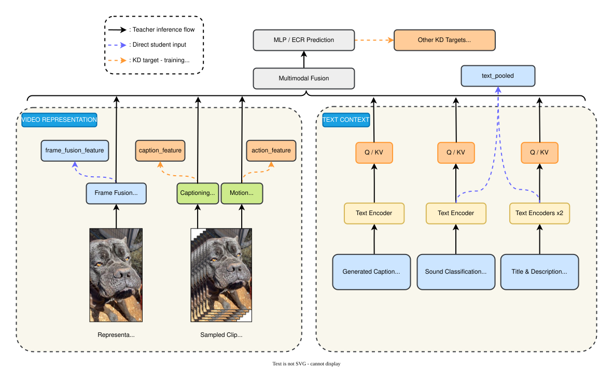
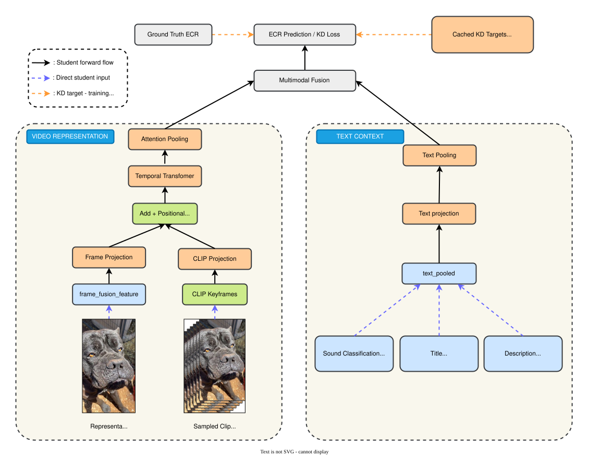
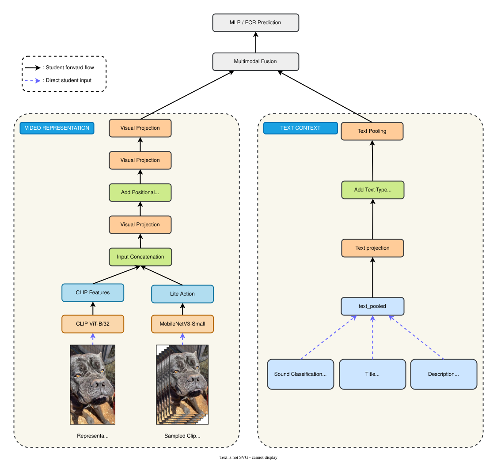

# SnapUGC-LightKD

Thesis code for a bounded 5000-video SnapUGC knowledge-distillation study.

The current main experiment uses the authors' released SnapUGC EVQA teacher
from `dasongli1/SnapUGC_Engagement` on one fixed, balanced 5000-video subset.
Local code prepares the subset, runs/monitors the official teacher on GCloud,
exports teacher artifacts for KD, and keeps student/baseline experiments
separate from the teacher reproduction.

## Current Pipeline

```text
Balanced 5000-video subset
  -> official SnapUGC EVQA teacher inference on GCloud L4
     - EfficientNetV2-s semantic frame features
     - UVQ-style distortion features
     - ResNet3D-18 action features
     - mPLUG-2 caption and clip features
     - YAMNet sound labels
     - Stable Diffusion text encoder
     - EVQA.pth ECR head
  -> scalar teacher ECR + hidden/attention/artifact shards
  -> lightweight student baseline and KD experiments
```

The official teacher architecture is not reimplemented in
`src/snapugc_lightkd/official_student.py`. A pinned local copy of the real teacher source
lives in `third_party/SnapUGC_Engagement/ECR_inference/`. Runtime code patches
a working copy only for compatibility/artifact export. See
`docs/original_snapugc_exact_reproduction.md` for file-level architecture
details, and `docs/gcp_official_inference_artifacts_readme.md` for the concrete
Google Cloud runbook used to run official inference and export teacher artifact
shards.

## Dataset And Split

The thesis uses one locked balanced 5000-video subset:

```text
data/train_subset_balanced_5000.csv
data/official_balanced_5000_videos/
data/official_5k_split/
```

The zip archive below contains the 5000 videos, labels, and fixed split files:

```text
data/official_snapugc_5k_locked_dataset.zip
```

Student experiments use a deterministic `4000/1000` split:

```text
seed = 42
val_ratio = 0.2
rows = official teacher artifact rows sorted by order_idx
test/val = first 1000 indices after np.random.default_rng(42).shuffle(...)
train = remaining 4000 rows
```

Split files:

```text
data/official_5k_split/train_4000.csv
data/official_5k_split/test_1000.csv
data/official_5k_split/split_all_5000.csv
data/official_5k_split/manifest.json
```

In the code, the 1000 held-out rows are named `val` because they are used for
model selection. In thesis writing, call them a fixed validation/test split and
state the split protocol clearly.

### Dataset Visualizations

* **Dataset Samples**: A grid of sample video frame thumbnails from the SnapUGC dataset with their corresponding ECR quality scores overlayed:

  

* **ECR Score Distribution**: The distribution of Engagement Continuation Ratio (ECR) scores across the balanced 5000-video subset, comparing the train and validation splits:

  

* **Dataset Overview & Statistics**: Analysis of ECR quality band bar chart, Cumulative Distribution Function (CDF), percentile stats, and metadata counts:

  

* **ECR Quality Bands Detail**: Per-band score distribution comparison across low, medium, and high quality regions:

  

## Repository Structure

```text
SnapUGC-LightKD/
  data/                    # local 5k subset/videos; ignored by git
  docs/                    # reproduction notes and locked result summaries
  notebooks/               # official Kaggle notebook kept for reproducibility
  results/                 # generated reports/checkpoints; ignored by git
  scripts/
    extract_clip_keyframe_features.py   # extract CLIP ViT-B/32 keyframe embeddings from video tar
    train_official_student_kd.py        # student baseline and KD training
    evaluate_student_ensemble.py        # ensemble evaluation over multiple checkpoints
    run_official_snapugc_evqa.py        # official teacher inference wrapper
    make_subset.py                      # create balanced 5k video subset
  src/snapugc_lightkd/     # student artifact dataset/model helpers
  third_party/             # pinned official teacher source, no checkpoints
```

## Setup

```bash
python3 -m venv .venv
source .venv/bin/activate
pip install -U pip
pip install -e .
```

On GCloud/L4, install the CUDA-compatible PyTorch wheel before running the
official teacher wrapper.

## Model Inputs And Outputs

This project has three model roles:

```text
1. Official teacher
   Input: raw video + title + description
   Output: teacher ECR plus artifact shards for KD

2. Student baseline
   Input: reduced teacher-extracted artifacts only
   Output: student ECR
   Loss: ground-truth ECR only

3. Student KD
   Input: exactly the same reduced inputs as student baseline
   Output: student ECR plus training-only KD outputs
   Loss: ground-truth ECR + teacher ECR/artifact/ranking distillation
```

The deployable student never sees the full privileged teacher input stack at
inference time. The retained deployable preset is `visual_text_sound` with
an optional CLIP semantic branch (best configuration):

```text
Student input preset: visual_text_sound
- frame_fusion_feature: T x 1024          (EfficientNetV2-s + UVQ, from teacher artifacts)
- YAMNet top sound labels text emb: 1 x 768
- title pooled text embedding:     1 x 768
- description pooled text emb:     1 x 768

[Optional, deployable] CLIP ViT-B/32 keyframe embeddings:
- quality_features: T x 512               (CLIP image encoder on 16 uniform keyframes)
- quality_fusion: clip_add                (added into hidden space after temporal encoder)
```

Learned source/type embeddings distinguish sound labels, title, and description
before text pooling. The `clip_add` fusion adds CLIP embeddings into the
hidden representation after temporal encoding — acting as late semantic gating.

The teacher artifacts available for KD are:

```text
teacher_ecr: scalar
teacher_clip_ecr: T
teacher_temporal_hidden: T x 512
teacher_fusion_hidden: T x 512
teacher_attention_importance: attention_layers x T
```

## Official Teacher Run

The primary GCloud runner is:

```bash
SHUTDOWN_ON_EXIT=1 \
ROOT_DIR=/workspace/SnapUGC-LightKD \
SUBSET_CSV=/workspace/snapugc-data/train_subset_balanced_5000.csv \
VIDEO_DIR=/workspace/snapugc-data/train_videos_balanced_5000 \
OUT_DIR=/workspace/results/original_snapugc_official_balanced_5000_artifacts_g2_32 \
CHECKPOINT_DIR=/workspace/snapugc-checkpoints \
EXPORT_ARTIFACTS=1 \
ARTIFACT_SHARD_SIZE=25 \
bash scripts/run_gcp_official_balanced_5k_from_links.sh
```

The run writes partial reports every 500 predictions and artifact shards every
25 videos:

```text
official_partial_500_predictions.csv
official_partial_500_report.json
teacher_artifacts/official_teacher_artifacts_0000_0024.npz
teacher_artifacts/official_teacher_artifacts_0000_0024_captions.jsonl
```

Sync outputs back to local:

```bash
PROJECT=snapugc-lightkd \
ZONE=asia-southeast1-a \
INSTANCE=snapugc-l4-artifacts \
REMOTE_OUT_DIR=/workspace/results/original_snapugc_official_balanced_5000_artifacts_g2_32 \
LOCAL_OUT_DIR=results/original_snapugc_official_balanced_5000_artifacts_g2_32 \
bash scripts/sync_gcp_official_5k_outputs.sh
```

## Architecture Overview

The three final architecture diagrams used in the thesis are shown below. They cover the official teacher artifact pipeline, the full Student KD training graph, and the self-contained Proper KD inference pipeline.

### 1. Official Teacher Architecture

The teacher is the released SnapUGC EVQA inference stack from the original authors. It is a heavyweight, multimodal model that combines several pretrained extractors and text encoders to model video quality. 

During the feature extraction phase, the frozen teacher extracts semantic frame features (EfficientNetV2-s), distortion features (UVQ), action features (ResNet3D-18), caption/CLIP features (mPLUG-2), sound labels (YAMNet), and text metadata (Stable Diffusion text encoder). These intermediate representations and attention matrices are exported as teacher artifact shards to guide student training.

**Teacher artifact extraction pipeline**



Teacher output files:

```text
official_submission_baseline.csv      # Id, ECR prediction
official_evqa_report.json             # PLCC, SRCC, final score, MSE, MAE
teacher_artifacts/*.npz               # hidden states, clip outputs, attention
teacher_artifacts/*_captions.jsonl    # generated captions
```

The official teacher is inference-only in this project; we use the released checkpoints and do not retrain the original teacher.

### 2. Student KD Training Architecture

The Student is designed as a highly compact model optimized for edge deployment. Its lightweight temporal Transformer processes frame-level and text features; the Proper KD preset replaces the teacher-dependent visual frontend with deployable CLIP and MobileNet backbones.

The student architecture is evaluated under two distinct deployment paradigms:
1. **Semi-independent / Head Distillation**: The student operates on pre-extracted video semantic and distortion features (`visual_text_sound` preset) plus CLIP features, and learns to mimic the teacher's fusion and prediction heads.
2. **Proper / Full Pipeline KD**: The student processes raw video frames directly on the edge using lightweight backbones (CLIP ViT-B/32 + MobileNetV3-Small) and is fully self-contained.

The training diagram shows the full KD objective for the `visual_text_sound` student (`hidden_dim=96`, 1 Transformer layer, 4 heads). It uses `frame_fusion_feature`, CLIP keyframe features, and text context in the student forward pass. Ground-truth ECR and cached teacher outputs are connected only to the training objective and are not runtime inputs.



### 3. Student Proper KD Inference Architecture

The inference diagram shows the self-contained `clip_mobilenet_text` pipeline. Sampled raw-video frames are encoded by CLIP ViT-B/32 and MobileNetV3-Small, concatenated per time step, and processed by the compact temporal Transformer together with text context. The teacher, cached KD targets, and training-only KD heads are absent at inference.



The two student diagrams intentionally document two evaluated deployment presets: the semi-independent `visual_text_sound` training configuration and the fully self-contained `clip_mobilenet_text` inference configuration.

### Student Model Hyperparameters

The base compact student configuration (preset: `visual_text_sound`) uses:

```text
hidden_dim = 96
Transformer layers = 1
heads = 4
dropout = 0.25
max_clips = 16
quality_fusion = clip_add
```

### Student KD Loss Formulation

During training, the student optimizes the following multi-component objective:

```text
loss_kd =
  hard_ecr      * MSE(student_ecr, true_ecr)
+ soft_ecr      * MSE(student_ecr, teacher_ecr)
+ clip_ecr      * MSE(student_clip_ecr, teacher_clip_ecr)
+ temporal      * repr_loss(project(student_temporal), teacher_temporal_hidden)
+ fusion        * repr_loss(project(student_hidden), mean(teacher_fusion_hidden))
+ attention     * KL(student_temporal_attention, teacher_attention_importance)
+ hard_rank     * pairwise_rank(student_ecr, true_ecr)
+ teacher_rank  * pairwise_rank(student_ecr, teacher_ecr)
```

The eight terms above are the core objective. The deployed best configuration
additionally enables small-weight auxiliary ranking/relation terms
(`teacher_pearson`, `teacher_spearman`, `teacher_listwise`,
`student_teacher_relation`, `contrastive_hidden`); these are training-only and
contribute marginally on top of the core terms.

### Scientific Loss Functions & Published Papers

Our KD architecture integrates advanced loss terms inspired by key scientific publications:

1. **Classic Logit KD & Soft Targets** (Hinton et al., NeurIPS 2015)
   * *Loss terms*: `soft_ecr` and `clip_ecr`.
   * *Concept*: Distills continuous soft predictions, transferring the "dark knowledge" of the teacher's absolute quality ratings.
   * *Paper*: *Distilling the Knowledge in a Neural Network*.

2. **FitNets Feature Alignment** (Romero et al., ICLR 2015)
   * *Loss terms*: `temporal` and `fusion`.
   * *Concept*: Aligns intermediate hidden states using a projection head to map student dimensions to the teacher's space.
   * *Paper*: *FitNets: Hints for Thin Deep Nets*.

3. **Attention Transfer (AT)** (Zagoruyko & Komodakis, ICLR 2017)
   * *Loss term*: `attention`.
   * *Concept*: Forces the student's temporal attention weights to mimic the teacher's attention maps via KL Divergence.
   * *Paper*: *Paying More Attention to Attention: Improving the Performance of Convolutional Neural Networks via Attention Transfer*.

4. **Pairwise Ranking Loss**
   * *Loss terms*: `hard_rank` and `teacher_rank`.
   * *Concept*: Optimizes relative ranking order among samples to ensure the student ranks video quality consistently with the teacher and ground truth.

### Loss Function Ablation Study

To systematically evaluate the contribution of each distillation layer, we perform a grouped cumulative ablation on the validation split using the `visual_text_sound` preset. The results are verified from training logs on disk:

| Tier | Loss Terms Included | Scientific Reference Mapping | Validation Final Score | Marginal Gain |
| :--- | :--- | :--- | :---: | :---: |
| **0. Baseline (No KD)** | `hard_ecr` | Standard regression baseline | **0.5609** | — |
| **1. Logit KD** | `hard_ecr` + `soft_ecr` + `clip_ecr` | Hinton et al. (NeurIPS 2015) | **0.5982** | `+0.0373` |
| **2. Feature & Attn KD** | Tier 1 + `temporal` + `fusion` + `attention` | Romero et al. (FitNets), Zagoruyko et al. (AT) | **0.6056** | `+0.0074` |
| **3. Full Student KD** | Tier 2 + `hard_rank` + `teacher_rank` + relation losses | Pairwise/listwise ranking and hidden relation losses | **0.6273** | `+0.0217` |

**Key Takeaways for Thesis Writing**:
- **Logit matching (Tier 1)** contributes the single largest individual performance leap (`+0.0373`), demonstrating the value of transferring continuous soft targets compared to hard ground-truth labels alone.
- **Pairwise and relation losses (Tier 3)** add a substantial gain of `+0.0217`, showing that relative order supervision is highly beneficial for subjective quality regression.
- **Feature and attention alignment (Tier 2)** provide a smaller but consistent representation-level gain.

### Best Training Command (CLIP clip_add + Full KD)

Step 1 — Extract CLIP ViT-B/32 keyframe features:

```bash
python scripts/extract_clip_keyframe_features.py \
  --tar results/videos_5000.tar \
  --labels-csv data/train_subset_balanced_5000.csv \
  --out results/clip_vitb32_keyframe_features_5000.npz \
  --model ViT-B-32 --pretrained openai \
  --n-frames 16 --device mps
```

Step 2 — Train the student:

```bash
python scripts/train_official_student_kd.py \
  --artifact-dir results/original_snapugc_official_balanced_5000_artifacts_g2_32/teacher_artifacts \
  --labels-csv data/train_subset_balanced_5000.csv \
  --save-dir results/kd_tuning_official_5k/student_kd_full_clipadd \
  --input-preset visual_text_sound \
  --quality-features results/clip_vitb32_keyframe_features_5000.npz \
  --quality-fusion clip_add \
  --hidden-dim 96 --layers 1 --heads 4 \
  --dropout 0.25 --epochs 100 --batch 32 --eval-batch 128 \
  --lr 5e-4 --weight-decay 0.02 \
  --val-ratio 0.2 --seed 42 --device mps --run-kind kd \
  --soft-weight 1.1 --clip-weight 0.08 \
  --temporal-weight 0.02 --fusion-weight 0.02 --attention-weight 0.005 \
  --hard-rank-weight 0.04 \
  --teacher-rank-weight 0.18 --teacher-pearson-weight 0.02 \
  --teacher-spearman-weight 0.015 --teacher-listwise-weight 0.02 \
  --student-teacher-relation-weight 0.02 --contrastive-hidden-weight 0.02
```

See [student_kd_architecture.md](file:///Users/top/Documents/HCMUS/KhoaLuan/SnapUGC-LightKD/docs/student_kd_architecture.md) for more details.

## Experimental Results


| Model | Inputs | PLCC | SRCC | Final Score | Params (train / inference-pruned) | Inference time / video | VRAM / video |
| :--- | :--- | :---: | :---: | :---: | :---: | :---: | :---: |
| **Teacher (Upper Bound)** | Raw video + Title + Description | 0.7103 | 0.6995 | **0.7038** | ~1,801.7M / same | ~10.0s | ~15.0GB |
| Baseline Student (No KD) | Frame fusion + CLIP + Text | 0.5629 | 0.5569 | 0.5593 | 433,092 / 378,723 | ≈0.68s* | ≈0.7GB* |
| Student KD basic | Frame fusion + CLIP + Text | 0.6277 | 0.6193 | 0.6227 | 433,092 / 378,723 | ≈0.68s* | ≈0.7GB* |
| Student KD full | Frame fusion + CLIP + Text | 0.6304 | 0.6252 | **0.6273** | 433,092 / 378,723 | ≈0.68s* | ≈0.7GB* |
| **Proper / Full Pipeline KD** (`clip_mobilenet_text`) | CLIP + MobileNet + Text (raw video, self-contained) | 0.5798 | 0.5743 | 0.5765 | 1,821,060 / 1,530,435 | ≈0.27s* | ≈0.4GB* |

\*End-to-end standalone cost, đo trên Apple M-series (`mps`), 16 frame/video. Semi-independent rows cần `frame_fusion` (EfficientNetV2-s + distortion net + lớp fusion EVQA, ~0.42s) → ≈0.68s; Proper KD chỉ cần CLIP ViT-B/32 + MobileNetV3-Small → ≈0.27s. Student head chỉ ~3ms — chi phí do backbone trích đặc trưng chi phối. **Lưu ý**: `frame_fusion` đòi hỏi front-end **đã-train của teacher**, nên chỉ **Proper / Full Pipeline KD** mới thật sự tự chứa khi suy luận; các dòng semi-independent triển khai như một head nhẹ gắn lên bộ trích đặc trưng của teacher. Teacher ~10s/~15GB là ước lượng L4 của nhóm tác giả (thiết bị khác).
