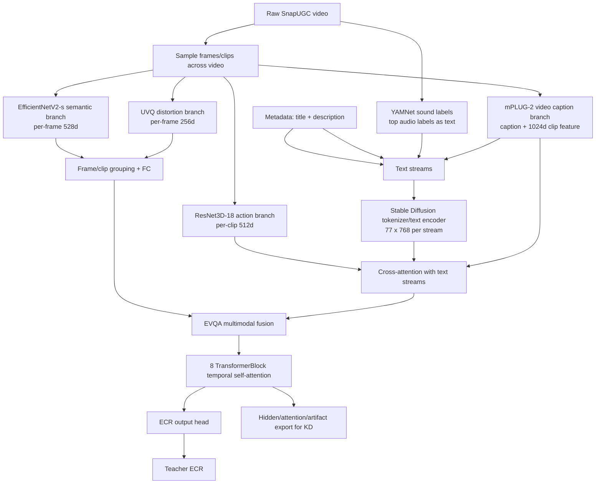
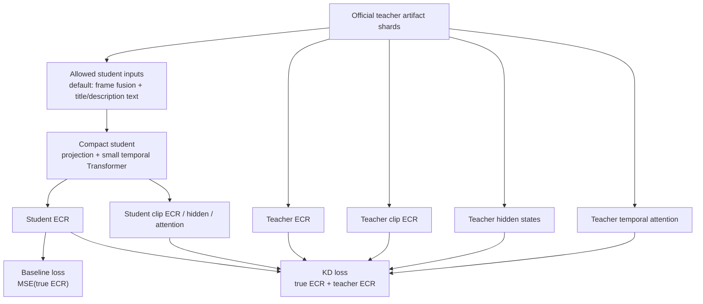
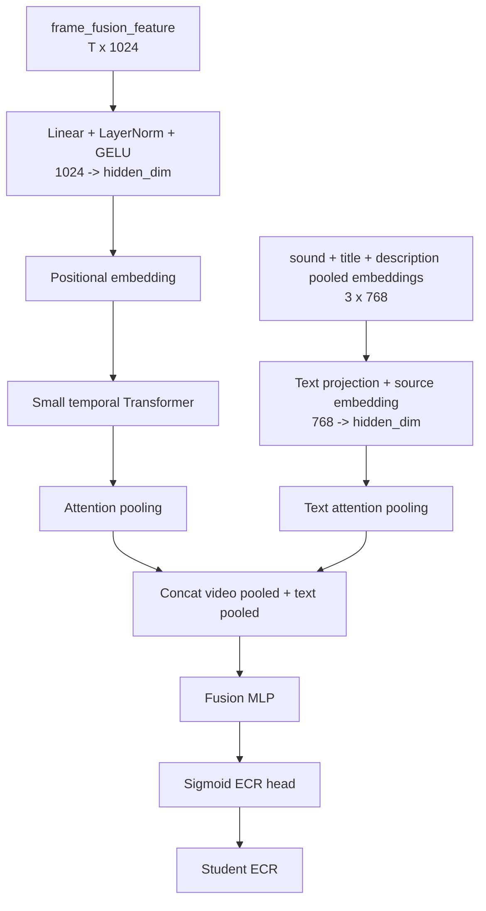

# SnapUGC-LightKD

Thesis code for a bounded 5000-video SnapUGC knowledge-distillation study.

The current main experiment uses the authors' released SnapUGC EVQA teacher
from `dasongli1/SnapUGC_Engagement` on one fixed, balanced 5000-video subset.
Local code prepares the subset, runs/monitors the official teacher on GCloud,
exports teacher artifacts for KD, and keeps student/baseline experiments
separate from the teacher reproduction.

## Current Pipeline

```text
Balanced 5000-video subset
  -> official SnapUGC EVQA teacher inference on GCloud L4
     - EfficientNetV2-s semantic frame features
     - UVQ-style distortion features
     - ResNet3D-18 action features
     - mPLUG-2 caption and clip features
     - YAMNet sound labels
     - Stable Diffusion text encoder
     - EVQA.pth ECR head
  -> scalar teacher ECR + hidden/attention/artifact shards
  -> lightweight student baseline and KD experiments
```

The official teacher architecture is not reimplemented in
`src/snapugc_lightkd/models.py`. A pinned local copy of the real teacher source
lives in `third_party/SnapUGC_Engagement/ECR_inference/`. Runtime code patches
a working copy only for compatibility/artifact export. See
`docs/original_snapugc_exact_reproduction.md` for file-level architecture
details, and `docs/gcp_official_inference_artifacts_readme.md` for the concrete
Google Cloud runbook used to run official inference and export teacher artifact
shards.

## Dataset And Split

The thesis uses one locked balanced 5000-video subset:

```text
data/train_subset_balanced_5000.csv
data/official_balanced_5000_videos/
data/official_5k_split/
```

The zip archive below contains the 5000 videos, labels, and fixed split files:

```text
data/official_snapugc_5k_locked_dataset.zip
```

Student experiments use a deterministic `4000/1000` split:

```text
seed = 42
val_ratio = 0.2
rows = official teacher artifact rows sorted by order_idx
test/val = first 1000 indices after np.random.default_rng(42).shuffle(...)
train = remaining 4000 rows
```

Split files:

```text
data/official_5k_split/train_4000.csv
data/official_5k_split/test_1000.csv
data/official_5k_split/split_all_5000.csv
data/official_5k_split/manifest.json
```

In the code, the 1000 held-out rows are named `val` because they are used for
model selection. In thesis writing, call them a fixed validation/test split and
state the split protocol clearly.

## Repository Structure

```text
SnapUGC-LightKD/
  data/                    # local 5k subset/videos; ignored by git
  docs/                    # reproduction notes and locked result summaries
  notebooks/               # official Kaggle notebook kept for reproducibility
  results/                 # generated reports/checkpoints; ignored by git
  scripts/                 # official teacher and student KD CLI wrappers
  src/snapugc_lightkd/     # student artifact dataset/model helpers
  third_party/             # pinned official teacher source, no checkpoints
```

## Setup

```bash
python3 -m venv .venv
source .venv/bin/activate
pip install -U pip
pip install -e .
```

On GCloud/L4, install the CUDA-compatible PyTorch wheel before running the
official teacher wrapper.

## Model Inputs And Outputs

This project has three model roles:

```text
1. Official teacher
   Input: raw video + title + description
   Output: teacher ECR plus artifact shards for KD

2. Student baseline
   Input: reduced teacher-extracted artifacts only
   Output: student ECR
   Loss: ground-truth ECR only

3. Student KD
   Input: exactly the same reduced inputs as student baseline
   Output: student ECR plus auxiliary student artifacts
   Loss: ground-truth ECR + teacher ECR/artifact/ranking distillation
```

The deployable student never sees the full privileged teacher input stack at
inference time. The retained deployable preset is `visual_text_sound`:

```text
Student input preset: visual_text_sound
- frame_fusion_feature: T x 1024
- YAMNet top sound labels pooled text embedding: 1 x 768
- title pooled text embedding: 1 x 768
- description pooled text embedding: 1 x 768
```

The current best single student also adds learned source/type embeddings before
text pooling, so the model can distinguish sound labels, title text, and
description text while keeping the same deployable input features.

The teacher artifacts available for KD are:

```text
teacher_ecr: scalar
teacher_clip_ecr: T
teacher_temporal_hidden: T x 512
teacher_fusion_hidden: T x 512
teacher_attention_importance: attention_layers x T
```

## Official Teacher Run

The primary GCloud runner is:

```bash
SHUTDOWN_ON_EXIT=1 \
ROOT_DIR=/workspace/SnapUGC-LightKD \
SUBSET_CSV=/workspace/snapugc-data/train_subset_balanced_5000.csv \
VIDEO_DIR=/workspace/snapugc-data/train_videos_balanced_5000 \
OUT_DIR=/workspace/results/original_snapugc_official_balanced_5000_artifacts_g2_32 \
CHECKPOINT_DIR=/workspace/snapugc-checkpoints \
EXPORT_ARTIFACTS=1 \
ARTIFACT_SHARD_SIZE=25 \
bash scripts/run_gcp_official_balanced_5k_from_links.sh
```

The run writes partial reports every 500 predictions and artifact shards every
25 videos:

```text
official_partial_500_predictions.csv
official_partial_500_report.json
teacher_artifacts/official_teacher_artifacts_0000_0024.npz
teacher_artifacts/official_teacher_artifacts_0000_0024_captions.jsonl
```

Sync outputs back to local:

```bash
PROJECT=snapugc-lightkd \
ZONE=asia-southeast1-a \
INSTANCE=snapugc-l4-artifacts \
REMOTE_OUT_DIR=/workspace/results/original_snapugc_official_balanced_5000_artifacts_g2_32 \
LOCAL_OUT_DIR=results/original_snapugc_official_balanced_5000_artifacts_g2_32 \
bash scripts/sync_gcp_official_5k_outputs.sh
```

## Official Teacher Architecture

The teacher is the released SnapUGC EVQA inference stack from the original
authors. It is heavyweight because it combines multiple pretrained components:



Teacher output files:

```text
official_submission_baseline.csv      # Id, ECR prediction
official_evqa_report.json             # PLCC, SRCC, final score, MSE, MAE
teacher_artifacts/*.npz               # hidden states, clip outputs, attention
teacher_artifacts/*_captions.jsonl    # generated captions
```

The official teacher is inference-only in this thesis: we use the released
checkpoints and do not retrain the original teacher.

## Student Work

Student baseline and KD are implemented separately from the official teacher.
They train from synced teacher artifact shards using reduced student inputs.



### Student Baseline Architecture

The deployable student is a compact model over the `visual_text_sound` artifacts:



The initial student used `hidden_dim=128`, `2` Transformer layers, and dropout
around `0.1`. The tuned compact student uses:

```text
hidden_dim = 96
Transformer layers = 1
heads = 4
dropout = 0.22
max_clips = 16
```

Baseline training objective:

```text
loss_baseline = MSE(student_ecr, true_ecr)
```

### Student KD Architecture And Loss

The KD student uses the same input and architecture as its baseline counterpart.
It adds auxiliary heads/projections only during training:

```text
student_clip_ecr: per-clip scalar predictions
project(student_temporal): T x 512 teacher-space tokens
project(student_hidden): 512 teacher-space pooled hidden state
student_temporal_attention: T
```

KD objective:

```text
loss_kd =
  hard_ecr      * MSE(student_ecr, true_ecr)
+ soft_ecr      * MSE(student_ecr, teacher_ecr)
+ clip_ecr      * MSE(student_clip_ecr, teacher_clip_ecr)
+ temporal      * repr_loss(project(student_temporal), teacher_temporal_hidden)
+ fusion        * repr_loss(project(student_hidden), mean(teacher_fusion_hidden))
+ attention     * KL(student_temporal_attention, teacher_attention_importance)
+ hard_rank     * pairwise_rank(student_ecr, true_ecr)
+ teacher_rank  * pairwise_rank(student_ecr, teacher_ecr)
```

`repr_loss` supports raw MSE, normalized MSE, and cosine distance. The tuned
model uses cosine representation KD because raw hidden-state MSE was too large
in scale and dominated scalar ECR/ranking losses.

Best tuned KD command with audio-derived sound text, learned text source/type
embeddings, and paper-guided score-shape KD:

```bash
python scripts/train_official_student_kd.py \
  --artifact-dir results/original_snapugc_official_balanced_5000_artifacts_g2_32/teacher_artifacts \
  --labels-csv data/train_subset_balanced_5000.csv \
  --save-dir results/kd_tuning_official_5k/v35_concat_source_embed_v22loss \
  --input-preset visual_text_sound \
  --epochs 80 \
  --batch 32 \
  --eval-batch 128 \
  --hidden-dim 96 \
  --layers 1 \
  --heads 4 \
  --dropout 0.22 \
  --lr 5e-4 \
  --weight-decay 0.01 \
  --repr-loss cosine \
  --soft-weight 1.1 \
  --clip-weight 0.08 \
  --temporal-weight 0.02 \
  --fusion-weight 0.02 \
  --attention-weight 0.005 \
  --hard-rank-weight 0.04 \
  --teacher-rank-weight 0.18 \
  --teacher-pearson-weight 0.02 \
  --teacher-spearman-weight 0.015 \
  --teacher-listwise-weight 0.02 \
  --rank-temperature 0.15 \
  --soft-rank-temperature 0.08
```

See `docs/student_kd_architecture.md` for the student baseline/KD diagram,
input presets, and KD losses.

The report includes PLCC, SRCC, KRCC, MSE, MAE, and
`final_score = 0.6 * SRCC + 0.4 * PLCC`.

## Retained 5k Results

The repo now keeps only the current deployable KD student and one upper-bound
compressed student under `results/kd_tuning_official_5k/`.

```text
Official teacher, full 5000 eval:
PLCC  = 0.7146
SRCC  = 0.7075
Final = 0.7103

Fair 1000-video validation split:
Teacher                         Final = 0.7038
Deployable KD student            Final = 0.6027
Compressed teacher-token student Final = 0.6947
```

| Version | Input preset | Params | Final | Note |
|---|---|---:|---:|---|
| `v35_concat_source_embed_v22loss` | `visual_text_sound` | 383,652 | 0.6027 | deployable KD student |
| `upper_teacher_compressed_tokens_baseline` | `teacher_compressed_tokens` | 712,068 | 0.6947 | upper-bound, not deployable without teacher-like compressed tokens |

`visual_text_sound` does not use raw audio embeddings. It uses the same
audio-derived representation as the official teacher: YAMNet top-5 sound labels
encoded by the Stable Diffusion/CLIP text encoder and saved as
`text_pooled[0]`.

See `docs/student_kd_architecture.md` for exact inputs, architecture, losses,
commands, and interpretation.
