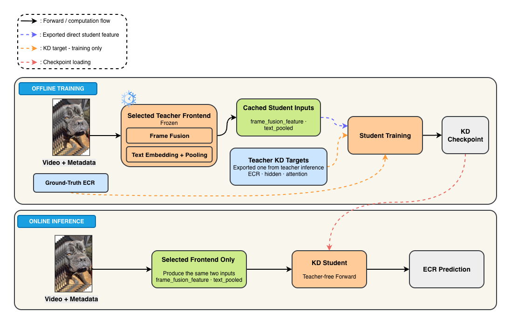
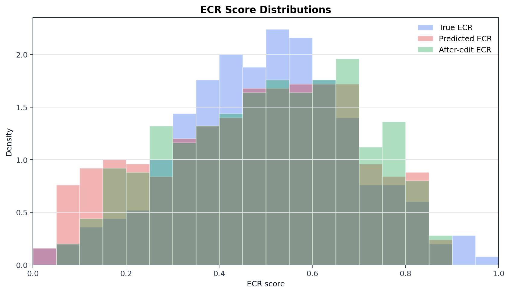
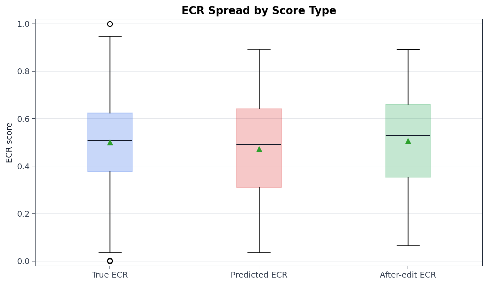
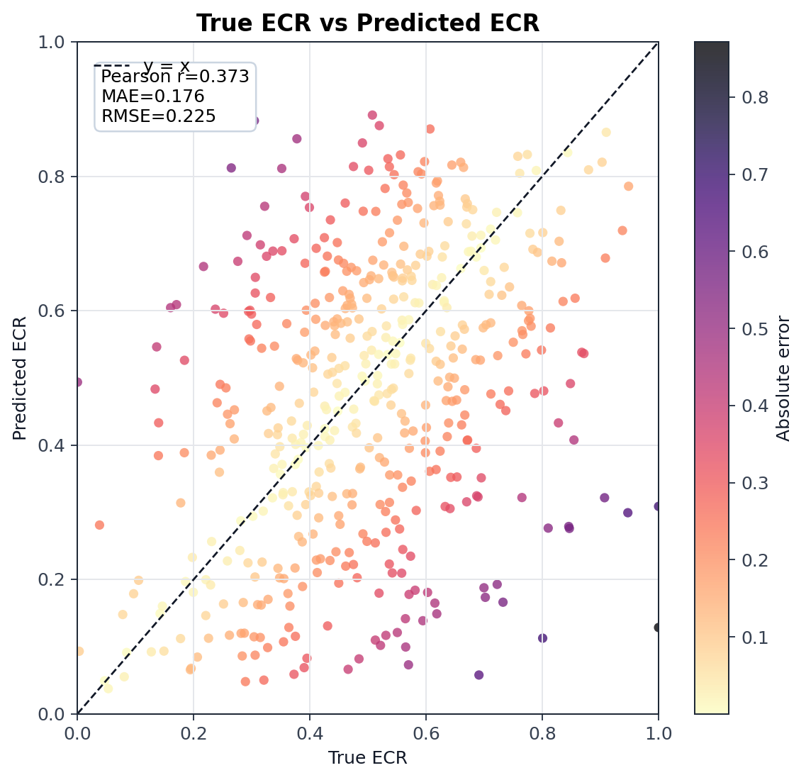
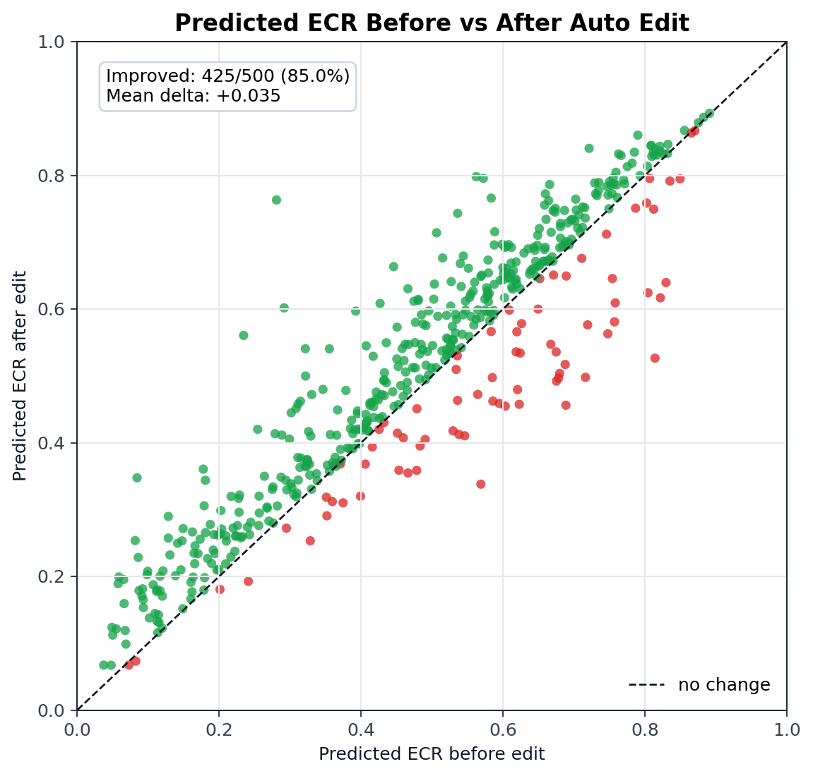
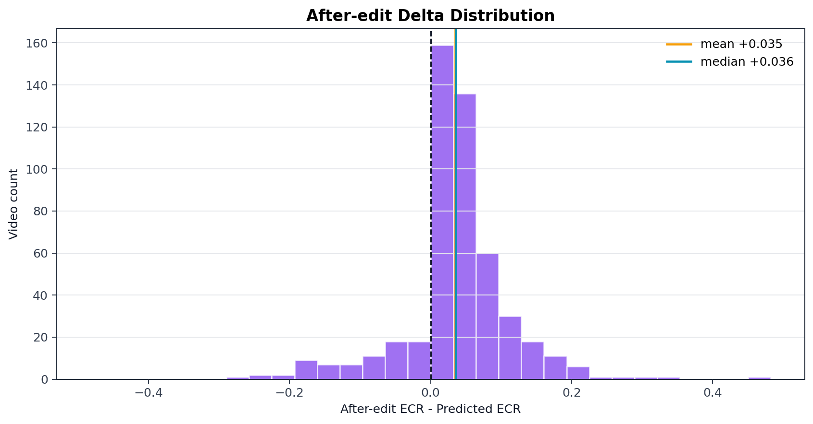
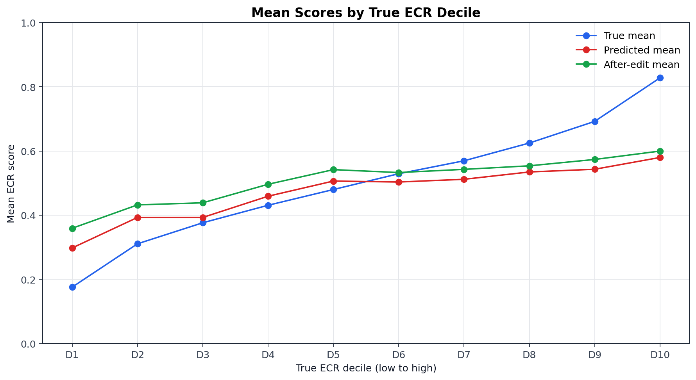

# SnapUGC-LightKD

Thesis code for a bounded 5000-video SnapUGC knowledge-distillation study.

The current main experiment uses the authors' released SnapUGC EVQA teacher
from `dasongli1/SnapUGC_Engagement` on one fixed, balanced 5000-video subset.
Local code prepares the subset, runs/monitors the official teacher on GCloud,
exports teacher artifacts for KD, and keeps student/baseline experiments
separate from the teacher reproduction.

## Current Pipeline

```text
Balanced 5000-video subset
  -> official SnapUGC EVQA teacher inference on GCloud L4
     - EfficientNetV2-s semantic frame features
     - UVQ-style distortion features
     - ResNet3D-18 action features
     - mPLUG-2 caption and clip features
     - YAMNet sound labels
     - Stable Diffusion text encoder
     - EVQA.pth ECR head
  -> scalar teacher ECR + hidden/attention/artifact shards
  -> lightweight student baseline and KD experiments
```

The online demo is a separate teacher-free path:

```text
new video + title + description
  -> CLIP ViT-B/32 + MobileNetV3-Small + Stable Diffusion text encoder
  -> Proper KD student checkpoint
  -> predicted ECR + grounded explanation + editable suggestions
  -> optional bounded auto-edit and student rerun
```

The official teacher architecture is not reimplemented in
`src/snapugc_lightkd/official_student.py`. A pinned local copy of the real teacher source
lives in `third_party/SnapUGC_Engagement/ECR_inference/`. Runtime code patches
a working copy only for compatibility/artifact export. See
`docs/original_snapugc_exact_reproduction.md` for file-level architecture
details, and `docs/gcp_official_inference_artifacts_readme.md` for the concrete
Google Cloud runbook used to run official inference and export teacher artifact
shards.

## Dataset And Split

The thesis uses one locked balanced 5000-video subset:

```text
data/train_subset_balanced_5000.csv
data/official_balanced_5000_videos/
data/official_5k_split/
```

The zip archive below contains the 5000 videos, labels, and fixed split files:

```text
data/official_snapugc_5k_locked_dataset.zip
```

The final student protocol uses a deterministic `4000/500/500` split:

```text
split seed = 20260706
train = 4000 videos
validation = 500 videos for checkpoint selection
locked student test = 500 videos for final reporting
```

Split files:

```text
data/official_5k_split_4000_500_500/train_ids.txt
data/official_5k_split_4000_500_500/val_ids.txt
data/official_5k_split_4000_500_500/test_ids.txt
data/official_5k_split_4000_500_500/manifest.json
```

Teacher artifacts were precomputed independently for all 5000 videos. The
locked test is held out only from student training and model selection; it is
not teacher-held-out or cross-domain.

### Dataset Visualizations

* **Dataset Samples**: A grid of sample video frame thumbnails from the SnapUGC dataset with their corresponding ECR quality scores overlayed:

  

* **ECR Score Distribution**: The distribution of Engagement Continuation Ratio (ECR) scores across the balanced 5000-video subset, comparing the train and validation splits:

  

* **Dataset Overview & Statistics**: Analysis of ECR quality band bar chart, Cumulative Distribution Function (CDF), percentile stats, and metadata counts:

  

* **ECR Quality Bands Detail**: Per-band score distribution comparison across low, medium, and high quality regions:

  

## Repository Structure

```text
SnapUGC-LightKD/
  data/                    # local 5k subset/videos; ignored by git
  docs/                    # reproduction notes and locked result summaries
  notebooks/               # official Kaggle notebook kept for reproducibility
  results/                 # generated reports/checkpoints; ignored by git
  scripts/
    extract_clip_keyframe_features.py   # extract CLIP ViT-B/32 keyframe embeddings from video tar
    train_official_student_kd.py        # student baseline and KD training
    evaluate_student_ensemble.py        # ensemble evaluation over multiple checkpoints
    run_official_snapugc_evqa.py        # official teacher inference wrapper
    infer_new_video_with_student_expl.py # Proper KD prediction and grounded explanation
    run_demo_proper_kd_local_llm.sh      # local UI launcher (default port 7861)
    run_proper_kd_auto_edit_batch.py     # batch analyze/edit/rerun workflow
    make_subset.py                      # create balanced 5k video subset
  src/snapugc_lightkd/     # student artifact dataset/model helpers
  third_party/             # pinned official teacher source, no checkpoints
```

## Setup

```bash
python3 -m venv .venv
source .venv/bin/activate
pip install -U pip
pip install -e .
```

On GCloud/L4, install the CUDA-compatible PyTorch wheel before running the
official teacher wrapper.

## Explain Demo

The current UI is a teacher-free Proper KD demo for new videos. It uses the
`clip_mobilenet_text` checkpoint (`hidden_dim=192`, 2 Transformer layers) and
reconstructs every online student input from the uploaded video and metadata:

```text
video -> at most 16 uniformly sampled clips
      -> CLIP ViT-B/32 image embedding (512-D)
      +  MobileNetV3-Small spatial-motion vector (1152-D)
      -> T x 1664 visual student input

title + description
      -> Stable Diffusion CLIP text encoder with mean-token pooling
      -> 3 x 768 checkpoint-compatible text input
```

The three text positions retain the training-time `sound/title/description`
order. The current demo has no lightweight audio labeler, so `sound` is an
empty placeholder. Empty sources are kept in the model tensor for checkpoint
compatibility but are excluded from explanation ablation, ranking, and display.
The teacher, EfficientNetV2-S, teacher artifacts, and KD losses are not called
during demo inference.

The default report and checkpoint are:

```text
results/kd_tuning_official_5k/v05_small_cosine_rank/official_student_kd_report.json
results/kd_tuning_official_5k/v05_small_cosine_rank/student_kd_best.pth
```

### Student-Only New-Video Explanation

```bash
python scripts/infer_new_video_with_student_expl.py \
  --video /path/to/new_video.mp4 \
  --title "Short, specific title" \
  --description "Optional context" \
  --report-json results/kd_tuning_official_5k/v05_small_cosine_rank/official_student_kd_report.json \
  --checkpoint results/kd_tuning_official_5k/v05_small_cosine_rank/student_kd_best.pth \
  --labels-csv data/official_5k_split/split_all_5000.csv \
  --input-preset clip_mobilenet_text \
  --out-json results/demo_runs/example/result.json \
  --assets-dir results/demo_runs/example/assets
```

The explanation flow is:

```text
student outputs: ECR, clip attention, clip ECR, text attention
  -> zero each clip and each non-empty text source; measure student ECR change
  -> rank evidence by ablation impact + student attention
  -> attach deterministic motion, lighting, clarity, hook, text, and pacing labels
  -> build a grounded structured evidence package
  -> constrained local/API LLM verbalization or deterministic template fallback
  -> explanation + publishable title/description + editing recommendations
```

The generated JSON includes the raw checkpoint ECR, empirical engagement band,
ranked clips and thumbnails, non-empty text evidence, semantic attributes,
natural-language explanation, and recommendations split into immediately
feasible post-production changes versus content/reshoot changes. The LLM only
rewrites the structured evidence package; a grounding guard removes unsupported
claims and falls back to a deterministic template when generation fails. This
is post-hoc attribution and constrained verbalization, not a formal causal
faithfulness guarantee.

### Demo UI

Install and start the local UI:

```bash
python -m pip install -r requirements.txt -r requirements-demo.txt
brew install ffmpeg  # macOS; otherwise install ffmpeg with the system package manager
```

For the local Qwen3.5-4B verbalizer, also install its isolated runtime:

```bash
python -m pip install -r requirements-local-llm.txt
```

This optional file pins the tested Transformers revision required by Qwen3.5.
Leaving it out keeps the core environment compatible with the older
official-model notebooks and still allows OpenAI API or template explanations.

Generated reports and checkpoints under `results/` are intentionally not
tracked by Git. Place the Proper KD report/checkpoint at the default paths above
or set `SNAPUGC_REPORT_JSON` and `SNAPUGC_STUDENT_CHECKPOINT` to existing local
files. The preparation step can copy `~/Downloads/student_kd_best.pth` into the
default checkpoint path, but it still requires the report JSON to exist.

```bash
# First run: verify/copy the checkpoint and cache the visual/text encoders and LLM.

SNAPUGC_PREPARE_PROPER_KD=1 \
SNAPUGC_PREPARE_LOCAL_LLM=1 \
bash scripts/run_demo_proper_kd_local_llm.sh
```

For later runs:

```bash
bash scripts/run_demo_proper_kd_local_llm.sh
```

Open `http://127.0.0.1:7861`. Override the port with
`SNAPUGC_DEMO_PORT=<port>`. The launcher defaults to `auto` mode with the local
`Qwen/Qwen3.5-4B` verbalizer in non-thinking mode. The explanation backend is
selected in this order: cached local Qwen, OpenAI-compatible API when an API
key is configured, then the deterministic grounded template. To run without an
LLM, use:

```bash
SNAPUGC_LLM_BACKEND=template bash scripts/run_demo_proper_kd_local_llm.sh
```

Optional OpenAI API fallback configuration:

```bash
export OPENAI_API_KEY="..."
export SNAPUGC_LLM_MODEL="gpt-4o-mini"
bash scripts/run_demo_proper_kd_local_llm.sh
```

With the default `auto` backend, these variables are used only when local Qwen
is unavailable or inference fails. Set `SNAPUGC_LLM_FALLBACK_TO_OPENAI=0` with
`SNAPUGC_LLM_BACKEND=local` to disable that fallback. To force a remote
OpenAI-compatible endpoint instead of trying local Qwen first, use:

```bash
export SNAPUGC_LLM_BACKEND="openai"
export SNAPUGC_LLM_API_KEY="..."
export SNAPUGC_LLM_BASE_URL="https://api.openai.com/v1"
export SNAPUGC_LLM_MODEL="gpt-4o-mini"
bash scripts/run_demo_proper_kd_local_llm.sh
```

The UI displays model/checkpoint and LLM health, prediction and band, top clip
evidence, semantic attributes, grouped recommendations, and editable suggested
title/description fields. Suggested metadata is publishable text, while the
diagnostic rationale stays in separate recommendation fields.

`Chỉnh video` applies bounded brightness, contrast, sharpness, or saturation
changes only to non-top-evidence clips, preserves the original timeline and
audio, applies the user-editable metadata suggestion, reruns the same student,
and reports before/after predicted ECR. `ffmpeg` is required for audio
preservation; the operation fails instead of silently returning a muted video.
The editor never invents scenes, actions, or objects.

Inference is fail-closed: the UI and CLI refuse to run if the report is missing,
the checkpoint is missing, or its state dictionary is incomplete/incompatible.

## Model Inputs And Outputs

This project evaluates four model roles/configurations:

```text
1. Official teacher
   Input: raw video + title + description
   Output: teacher ECR plus artifact shards for KD

2. Student baseline
   Input: reduced teacher-extracted artifacts only
   Output: student ECR
   Loss: ground-truth ECR only

3. Student KD
   Input: exactly the same reduced inputs as student baseline
   Output: student ECR plus training-only KD outputs
   Loss: ground-truth ECR + teacher ECR/artifact/ranking distillation

4. Proper KD student
   Training input: CLIP + MobileNet visual features and cached text embeddings
   Demo input: the same visual features and regenerated title/description embeddings
   Output: student ECR plus post-hoc evidence at inference
   Loss: ground-truth ECR + teacher ECR/artifact/ranking distillation during training only
```

The two student presets serve different experimental questions. The
semi-independent `visual_text_sound` preset measures a compact distilled head
over cached teacher-frontend features:

```text
Student input preset: visual_text_sound
- frame_fusion_feature: T x 1024          (EfficientNetV2-s + UVQ, from teacher artifacts)
- YAMNet top sound labels text emb: 1 x 768
- title pooled text embedding:     1 x 768
- description pooled text emb:     1 x 768

[Optional] CLIP ViT-B/32 keyframe embeddings:
- quality_features: T x 512               (CLIP image encoder on 16 uniform keyframes)
- quality_fusion: clip_add                (added into hidden space after temporal encoder)
```

Learned source/type embeddings distinguish sound labels, title, and description
before text pooling. The `clip_add` fusion adds CLIP embeddings into the
hidden representation after temporal encoding, acting as late semantic gating.

The current raw-video UI instead uses `clip_mobilenet_text`:

```text
- CLIP ViT-B/32 frame embedding:            T x 512
- MobileNetV3-Small spatial-motion vector:  T x 1152
- concatenated visual input:                T x 1664
- sound/title/description text positions:   3 x 768
```

This Proper KD path does not consume `frame_fusion_feature`, EfficientNet/UVQ
features, or any teacher target at inference.

The teacher artifacts available for KD are:

```text
teacher_ecr: scalar
teacher_clip_ecr: T
teacher_temporal_hidden: T x 512
teacher_fusion_hidden: T x 512
teacher_attention_importance: attention_layers x T
```

## Official Teacher Run

The primary GCloud runner is:

```bash
SHUTDOWN_ON_EXIT=1 \
ROOT_DIR=/workspace/SnapUGC-LightKD \
SUBSET_CSV=/workspace/snapugc-data/train_subset_balanced_5000.csv \
VIDEO_DIR=/workspace/snapugc-data/train_videos_balanced_5000 \
OUT_DIR=/workspace/results/original_snapugc_official_balanced_5000_artifacts_g2_32 \
CHECKPOINT_DIR=/workspace/snapugc-checkpoints \
EXPORT_ARTIFACTS=1 \
ARTIFACT_SHARD_SIZE=25 \
bash scripts/run_gcp_official_balanced_5k_from_links.sh
```

The run writes partial reports every 500 predictions and artifact shards every
25 videos:

```text
official_partial_500_predictions.csv
official_partial_500_report.json
teacher_artifacts/official_teacher_artifacts_0000_0024.npz
teacher_artifacts/official_teacher_artifacts_0000_0024_captions.jsonl
```

Sync outputs back to local:

```bash
PROJECT=snapugc-lightkd \
ZONE=asia-southeast1-a \
INSTANCE=snapugc-l4-artifacts \
REMOTE_OUT_DIR=/workspace/results/original_snapugc_official_balanced_5000_artifacts_g2_32 \
LOCAL_OUT_DIR=results/original_snapugc_official_balanced_5000_artifacts_g2_32 \
bash scripts/sync_gcp_official_5k_outputs.sh
```

## Architecture Overview

The four diagrams below separate the end-to-end lifecycle, frozen teacher,
semi-independent student training graph, and Proper KD deployment graph. Across
all diagrams, blue blocks are external inputs, orange blocks are modules,
green blocks are intermediate representations, and gray blocks are outputs.
Solid black arrows show forward computation; blue dashed arrows show exported
direct student features; orange dashed arrows show training-only supervision.

### 1. End-to-End Teacher-Student Pipeline

Offline, the frozen teacher exports direct student features and privileged KD
targets, while ground-truth ECR supervises the student objective. The resulting
checkpoint is then loaded by the teacher-free Proper KD student for online
inference on a new video and its metadata.



### 2. Official Teacher Inference Architecture

The released SnapUGC EVQA teacher combines EfficientNetV2-S semantic features,
UVQ distortion features, ResNet3D-18 motion features, mPLUG-2 caption features,
YAMNet sound labels, and Stable Diffusion text embeddings. Export hooks retain
`frame_fusion_feature` and `text_pooled` as direct semi-student inputs, together
with ECR, hidden-state, clip-level, and attention targets used only during KD.


Teacher output files:

```text
official_submission_baseline.csv      # Id, ECR prediction
official_evqa_report.json             # PLCC, SRCC, final score, MSE, MAE
teacher_artifacts/*.npz               # hidden states, clip outputs, attention
teacher_artifacts/*_captions.jsonl    # generated captions
```

The official teacher is inference-only in this project; we use the released
checkpoints and do not retrain the original teacher.

### 3. Semi-Independent Student KD Training Architecture

The student is designed as a compact model for edge-oriented deployment. Its
lightweight temporal Transformer processes frame-level and text features; the
Proper KD preset replaces the teacher-dependent visual frontend with CLIP and
MobileNet backbones.

The student architecture is evaluated under two distinct deployment paradigms:

1. **Semi-independent / Head Distillation**: The student operates on
   pre-extracted semantic/distortion features (`visual_text_sound`) plus CLIP
   features and learns to mimic the teacher's fusion and prediction heads.
2. **Proper / Full Pipeline KD**: The student replaces the teacher-dependent
   visual frontend with CLIP ViT-B/32 and MobileNetV3-Small. Training and locked
   evaluation use cached `text_pooled` values to preserve the experimental
   protocol; the current demo regenerates title/description embeddings with the
   same Stable Diffusion CLIP text encoder. The sound position remains empty
   because the demo does not package an audio labeler.

The training diagram shows the full KD objective for the `visual_text_sound`
student (`hidden_dim=96`, 1 Transformer layer, 4 heads). It uses
`frame_fusion_feature`, CLIP keyframe features, and text context in the student
forward pass. Ground-truth ECR and cached teacher outputs are connected only to
the training objective and are not runtime inputs.


### 4. Proper KD Student Inference Architecture

The deployment graph uses the `clip_mobilenet_text` preset. Sampled video
frames are encoded by CLIP ViT-B/32 and MobileNetV3-Small, concatenated per time
step, and processed by the compact temporal Transformer with title/description
context. Teacher visual features and all training-only KD targets are absent
from this ECR path.


The two student diagrams intentionally document the teacher-frontend-dependent
`visual_text_sound` configuration and the independent-visual
`clip_mobilenet_text` configuration.

### Student Model Hyperparameters

The base compact student configuration (preset: `visual_text_sound`) uses:

```text
hidden_dim = 96
Transformer layers = 1
heads = 4
dropout = 0.25
max_clips = 16
quality_fusion = clip_add
```

The current Proper KD demo checkpoint (`clip_mobilenet_text`) uses:

```text
clip_input_dim = 1664
text_input_dim = 768
hidden_dim = 192
Transformer layers = 2
heads = 4
dropout = 0.22
max_clips = 16
projection_head = mlp
```

### Student KD Loss Formulation

During training, the student optimizes the following multi-component objective:

```text
loss_kd =
  hard_ecr      * MSE(student_ecr, true_ecr)
+ soft_ecr      * MSE(student_ecr, teacher_ecr)
+ clip_ecr      * MSE(student_clip_ecr, teacher_clip_ecr)
+ temporal      * repr_loss(project(student_temporal), teacher_temporal_hidden)
+ fusion        * repr_loss(project(student_hidden), mean(teacher_fusion_hidden))
+ attention     * KL(student_temporal_attention, teacher_attention_importance)
+ hard_rank     * pairwise_rank(student_ecr, true_ecr)
+ teacher_rank  * pairwise_rank(student_ecr, teacher_ecr)
```

The eight terms above are the core objective. The best semi-independent Full-KD
configuration additionally enables small-weight auxiliary ranking/relation terms
(`teacher_pearson`, `teacher_spearman`, `teacher_listwise`,
`student_teacher_relation`, `contrastive_hidden`); these are training-only and
contribute marginally on top of the core terms.

### Scientific Loss Functions & Published Papers

Our KD architecture integrates advanced loss terms inspired by key scientific publications:

1. **Classic Logit KD & Soft Targets** (Hinton et al., NeurIPS 2015)
   * *Loss terms*: `soft_ecr` and `clip_ecr`.
   * *Concept*: Distills continuous soft predictions, transferring the "dark knowledge" of the teacher's absolute quality ratings.
   * *Paper*: *Distilling the Knowledge in a Neural Network*.

2. **FitNets Feature Alignment** (Romero et al., ICLR 2015)
   * *Loss terms*: `temporal` and `fusion`.
   * *Concept*: Aligns intermediate hidden states using a projection head to map student dimensions to the teacher's space.
   * *Paper*: *FitNets: Hints for Thin Deep Nets*.

3. **Attention Transfer (AT)** (Zagoruyko & Komodakis, ICLR 2017)
   * *Loss term*: `attention`.
   * *Concept*: Forces the student's temporal attention weights to mimic the teacher's attention maps via KL Divergence.
   * *Paper*: *Paying More Attention to Attention: Improving the Performance of Convolutional Neural Networks via Attention Transfer*.

4. **Pairwise Ranking Loss**
   * *Loss terms*: `hard_rank` and `teacher_rank`.
   * *Concept*: Optimizes relative ranking order among samples to ensure the student ranks video quality consistently with the teacher and ground truth.

### Loss Function Ablation Study

To systematically evaluate the contribution of each distillation layer, we perform a grouped cumulative ablation on the validation split using the `visual_text_sound` preset. The results are verified from training logs on disk:

| Tier | Loss Terms Included | Scientific Reference Mapping | Validation Final Score | Marginal Gain |
| :--- | :--- | :--- | :---: | :---: |
| **0. Baseline (No KD)** | `hard_ecr` | Standard regression baseline | **0.5609** | — |
| **1. Logit KD** | `hard_ecr` + `soft_ecr` + `clip_ecr` | Hinton et al. (NeurIPS 2015) | **0.5982** | `+0.0373` |
| **2. Feature & Attn KD** | Tier 1 + `temporal` + `fusion` + `attention` | Romero et al. (FitNets), Zagoruyko et al. (AT) | **0.6056** | `+0.0074` |
| **3. Full Student KD** | Tier 2 + `hard_rank` + `teacher_rank` + relation losses | Pairwise/listwise ranking and hidden relation losses | **0.6273** | `+0.0217` |

**Key Takeaways for Thesis Writing**:
- **Logit matching (Tier 1)** contributes the single largest individual performance leap (`+0.0373`), demonstrating the value of transferring continuous soft targets compared to hard ground-truth labels alone.
- **Pairwise and relation losses (Tier 3)** add a substantial gain of `+0.0217`, showing that relative order supervision is highly beneficial for subjective quality regression.
- **Feature and attention alignment (Tier 2)** provide a smaller but consistent representation-level gain.

### Best Semi-Independent Training Command (CLIP clip_add + Full KD)

Step 1 — Extract CLIP ViT-B/32 keyframe features:

```bash
python scripts/extract_clip_keyframe_features.py \
  --tar results/videos_5000.tar \
  --labels-csv data/train_subset_balanced_5000.csv \
  --out results/clip_vitb32_keyframe_features_5000.npz \
  --model ViT-B-32 --pretrained openai \
  --n-frames 16 --device mps
```

Step 2 — Train the student:

```bash
python scripts/train_official_student_kd.py \
  --artifact-dir results/original_snapugc_official_balanced_5000_artifacts_g2_32/teacher_artifacts \
  --labels-csv data/train_subset_balanced_5000.csv \
  --save-dir results/kd_tuning_official_5k/student_kd_full_clipadd \
  --input-preset visual_text_sound \
  --quality-features results/clip_vitb32_keyframe_features_5000.npz \
  --quality-fusion clip_add \
  --hidden-dim 96 --layers 1 --heads 4 \
  --dropout 0.25 --epochs 100 --batch 32 --eval-batch 128 \
  --lr 5e-4 --weight-decay 0.02 \
  --val-ratio 0.2 --seed 42 --device mps --run-kind kd \
  --soft-weight 1.1 --clip-weight 0.08 \
  --temporal-weight 0.02 --fusion-weight 0.02 --attention-weight 0.005 \
  --hard-rank-weight 0.04 \
  --teacher-rank-weight 0.18 --teacher-pearson-weight 0.02 \
  --teacher-spearman-weight 0.015 --teacher-listwise-weight 0.02 \
  --student-teacher-relation-weight 0.02 --contrastive-hidden-weight 0.02
```

See [student_kd_architecture.md](./docs/student_kd_architecture.md) for more details.

## Experimental Results

### Final 4000/500/500 protocol

Five Full-KD runs use the same explicit split IDs and training seeds 42–46.
Checkpoints are selected only on the 500-video validation set and then evaluated
on the 500-video locked student test.

| Model | Evaluated inputs | PLCC | SRCC | Final Score | Raw-input E2E params* (% teacher) | E2E latency / video |
| :--- | :--- | ---: | ---: | ---: | ---: | :--- |
| EVQA teacher reference | Raw video + title + description | 0.6958 | 0.6854 | **0.6895** | ~1,801.70M (100%) | ~34.6 s observed† |
| Baseline Student, no KD (Transformer) | Cached `frame_fusion` + CLIP + text | 0.5925 ± 0.0069 | 0.5911 ± 0.0054 | 0.5917 ± 0.0040 | ~274.11M (15.21%) | Not measured E2E‡ |
| Basic KD Student (logit-only) | Cached `frame_fusion` + CLIP + text | 0.6140 ± 0.0015 | 0.6066 ± 0.0032 | 0.6095 ± 0.0025 | ~274.11M (15.21%) | Not measured E2E‡ |
| MLP Student, no KD | Pooled cached `frame_fusion` + CLIP + text | 0.5856 ± 0.0042 | 0.5844 ± 0.0083 | 0.5849 ± 0.0059 | ~274.00M (15.21%) | Not measured E2E‡ |
| Ridge Student | Pooled cached `frame_fusion` + CLIP + text | 0.3745 | 0.3829 | 0.3795 | ~274.11M (15.21%) + regressor | Not measured E2E‡ |
| RBF-SVR Student | Pooled cached `frame_fusion` + CLIP + text | 0.5630 | 0.5556 | 0.5585 | ~274.11M (15.21%) + support vectors | Not measured E2E‡ |
| **Full KD Student** | Cached `frame_fusion` + CLIP + text | **0.6238 ± 0.0048** | **0.6149 ± 0.0056** | **0.6185 ± 0.0053** | **~274.11M (15.21%)** | Not measured E2E‡ |
| Proper No KD (`clip_mobilenet_text`, seed 42) | Raw-video CLIP + MobileNet; regenerated title/description text | 0.4927 | 0.4835 | 0.4871 | ~217.12M (12.05%) | Not measured E2E |
| Proper Basic KD, teacher ECR only (`clip_mobilenet_text`, seed 42) | Raw-video CLIP + MobileNet; regenerated title/description text | 0.5524 | 0.5386 | 0.5441 | ~217.12M (12.05%) | Not measured E2E |
| Proper / Full Pipeline KD (`clip_mobilenet_text`) | Raw-video CLIP + MobileNet; regenerated title/description text | 0.5699 | 0.5631 | 0.5658 | ~217.12M (12.05%) | ≤6.85 s measured§ |

Full KD beats logit-only KD on all `5/5` paired seeds. Its paired Final gain is
`+0.0089 ± 0.0032`, with a 95% t-interval `[+0.0050, +0.0129]`. Full KD also
improves over the hard-label Transformer mean by `+0.0268` Final. These results
separate the benefit of multi-loss distillation from the easier test sample.

The three Proper configurations close the independent-input ablation: all use
seed 42, the same CLIP + MobileNet input, student architecture, 4000/500/500
split, and checkpoint-selection protocol. Proper No KD optimizes only
`MSE(student_ecr, true_ecr)`. Proper Basic KD optimizes only
`MSE(student_ecr, teacher_ecr)`, with no hard-label, feature, attention,
ranking, or relation losses. Proper Full KD uses the complete objective.

Teacher-ECR-only distillation raises Final from `0.4871` to `0.5441`
(`+0.0569`), while the remaining full-KD signals add another `+0.0217`, reaching
`0.5658`. End to end, Full KD improves PLCC by `+0.0772`, SRCC by `+0.0796`,
and Final by `+0.0786` over No KD. This result shows that distillation remains
effective after removing the teacher's `frame_fusion` input and separates the
large contribution of soft teacher ECR from the additional contribution of
feature, attention, ranking, and relation transfer. Together with the lower
Proper Full-KD score relative to semi-independent Full KD, it supports the
interpretation that much of the remaining gap comes from the independent
student's weaker input representation rather than a failure of the KD
objective. Because the Proper comparison currently has one paired seed, these
effect sizes should not yet be reported as multi-seed means or confidence
intervals.

Sources:

```text
results/final_4000_500_500_2026/full_locked_test_evaluation.json
results/final_4000_500_500_2026/full_locked_test_predictions.csv
results/final_4000_500_500_2026/logit_locked_test_evaluation.json
results/final_4000_500_500_2026/hard_transformer_locked_test_evaluation.json
results/final_4000_500_500_2026/hard_mlp_locked_test_evaluation.json
results/final_4000_500_500_2026/proper_no_kd_locked_test_evaluation.json
results/final_4000_500_500_2026/proper_basic_kd_locked_test_evaluation.json
results/final_4000_500_500_2026/proper_kd_locked_test_evaluation.json
results/final_4000_500_500_2026/tabular_baselines.json
```

\*Counts include pretrained neural feature extractors required to recreate the evaluated inputs; decoding/tokenization is excluded. Classical estimator state is listed separately because support vectors are not neural parameters.

†Observed wall-clock throughput from the historical 5,000-video L4 teacher run, including artifact export; not a controlled same-hardware benchmark.

‡Only cached-input forward latency has been measured for these models (Full KD median `1.931 ms` on Apple M5). A raw-video E2E value is intentionally not inferred because producing `frame_fusion` requires the teacher frontend.

§A real cold raw-video Proper-KD run took `6.85 s`, but also generated counterfactual explanations and thumbnails. Therefore `6.85 s` is an upper bound on prediction-only inference, not a pure latency measurement.

The cached-input latency benchmark for the four neural student heads is stored
in `docs/benchmarks/student_forward_latency_apple_m5_4000_500_500.json`.

### Explanation And Auto-Edit Diagnostic Study (Delta85 Subset)

The end-to-end explanation and editing loop was also run on 1,000 videos drawn
from `train_data.csv` and verified not to overlap `official_5k_split`. For each
video, the batch pipeline analyzed the original video/title/description,
generated structured evidence and metadata suggestions, applied bounded visual
edits, and reran the same Proper KD student on the edited video and suggested
metadata. The batch used the deterministic template verbalizer rather than an
LLM so that language generation did not add run-to-run variance.

The results below are for a **post-hoc diagnostic subset**, not an unbiased
test set. Exactly 500 of the 1,000 completed runs were selected with seed
`20261430` across 20 True-ECR bins to preserve the source score distribution
while targeting 425 improved cases. Therefore, `85.0%` is a property of the
selection rule and must not be reported as the pipeline's expected success rate
on arbitrary videos. The unfiltered 1,000-run pool improved in `518/1000`
cases (`51.8%`), but it is also a diagnostic external sample rather than the
locked student benchmark. Its mean delta was `-0.0126` despite the slightly
positive median (`+0.0027`), showing that a minority of larger negative changes
outweighed many small positive changes before delta-based subset selection.

| Metric | Delta85 subset |
| :--- | ---: |
| Videos / unique IDs | 500 / 500 |
| Overlap with `official_5k_split` | 0 |
| True ECR mean / std | 0.5017 / 0.1843 |
| Predicted ECR mean / median | 0.4721 / 0.4912 |
| After-edit ECR mean / median | 0.5070 / 0.5296 |
| Improved / worsened | 425 / 75 |
| Mean / median delta | +0.0349 / +0.0358 |
| Delta interquartile range | [+0.0092, +0.0671] |
| True-vs-predicted Pearson / MAE / RMSE | 0.373 / 0.176 / 0.225 |

Local source artifacts:

```text
results/proper_kd_auto_edit_100_normal/subset500_normal_delta85/
  proper_kd_auto_edit_500_normal_delta85.xlsx
  selection_stats.json
  analysis/analysis_summary.json
```

#### Score Distributions



The selected True-ECR distribution retains almost exactly the 1,000-run source
mean and standard deviation (`0.5017/0.1843` versus `0.5018/0.1843`). Within
this selected subset, the after-edit distribution moves right relative to the
before-edit prediction, but the broad overlap shows that the selected edits do
not produce a uniform large shift across every video.



Both the mean and median increase after editing. The after-edit standard
deviation decreases from `0.2116` to `0.1988`, so the score shift is accompanied
by slightly less spread, while the wide boxes and whiskers show substantial
video-level variation remains.

#### Student Calibration On The Selected Videos



The student captures only a moderate cross-video relationship (`r=0.373`) and
shows regression toward the mean: low-True-ECR videos are often overpredicted,
while high-True-ECR videos are often underpredicted. Auto-edit therefore
optimizes the student's learned score, not observed post-publication engagement.

#### Before/After Auto-Edit



The scatter shows the constructed `425/500` split above and below the no-change
line. The remaining 75 decreases are operationally important: suggestions
should remain user-reviewable, and a production workflow should compare the
rerun score before accepting an edit.



The positive median confirms that the subset's gain is not produced only by a
few large positive outliers. The full range is still asymmetric and wide
(`-0.2876` to `+0.4823`), which exposes both strong wins and harmful edits that
would be hidden by the mean alone.



After-edit mean exceeds before-edit predicted mean in all ten True-ECR deciles
inside the selected subset. At the same time, the widening gap between True ECR
and both student curves in the highest deciles reinforces the calibration
limit: a higher student score is evidence of model-aligned improvement, not
proof of a real engagement increase.

### KD Efficiency Reporting Convention

Major KD work reports the model that actually runs at inference, not only the newly trained head. [DistilBERT](https://arxiv.org/abs/1910.01108) reports both model-size reduction and inference speed, while [TinyBERT](https://aclanthology.org/2020.findings-emnlp.372/) places `#Params`, FLOPs, and measured speedup beside task quality. Following that convention, this README uses raw-input end-to-end parameters for compression claims and retains student-module parameters only for checkpoint reproducibility. FLOPs and same-hardware latency remain future measurements and must not be inferred from parameter count alone.
