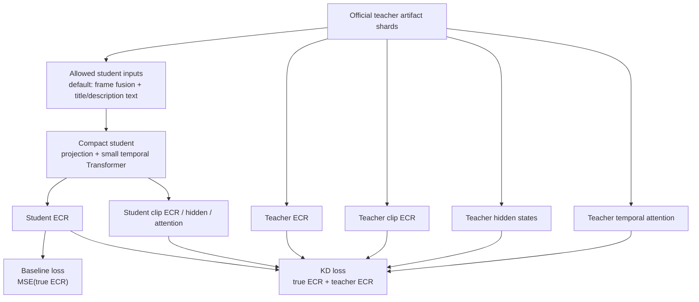

# SnapUGC-LightKD

Thesis code for a bounded 5000-video SnapUGC knowledge-distillation study.

The current main experiment uses the authors' released SnapUGC EVQA teacher
from `dasongli1/SnapUGC_Engagement` on one fixed, balanced 5000-video subset.
Local code prepares the subset, runs/monitors the official teacher on GCloud,
exports teacher artifacts for KD, and keeps student/baseline experiments
separate from the teacher reproduction.

## Current Pipeline

```text
Balanced 5000-video subset
  -> official SnapUGC EVQA teacher inference on GCloud L4
     - EfficientNetV2-s semantic frame features
     - UVQ-style distortion features
     - ResNet3D-18 action features
     - mPLUG-2 caption and clip features
     - YAMNet sound labels
     - Stable Diffusion text encoder
     - EVQA.pth ECR head
  -> scalar teacher ECR + hidden/attention/artifact shards
  -> lightweight student baseline and KD experiments
```

The official teacher architecture is not reimplemented in
`src/snapugc_lightkd/models.py`. A pinned local copy of the real teacher source
lives in `third_party/SnapUGC_Engagement/ECR_inference/`. Runtime code patches
a working copy only for compatibility/artifact export. See
`docs/original_snapugc_exact_reproduction.md` for file-level architecture
details.

## Repository Structure

```text
SnapUGC-LightKD/
  data/                    # local 5k subset/videos; ignored by git
  docs/                    # reproduction notes and locked result summaries
  notebooks/               # official Kaggle notebook kept for reproducibility
  results/                 # generated reports/checkpoints; ignored by git
  scripts/                 # official teacher and student KD CLI wrappers
  src/snapugc_lightkd/     # student artifact dataset/model helpers
  third_party/             # pinned official teacher source, no checkpoints
```

## Setup

```bash
python3 -m venv .venv
source .venv/bin/activate
pip install -U pip
pip install -e .
```

On GCloud/L4, install the CUDA-compatible PyTorch wheel before running the
official teacher wrapper.

## Official Teacher Run

The primary GCloud runner is:

```bash
SHUTDOWN_ON_EXIT=1 \
ROOT_DIR=/workspace/SnapUGC-LightKD \
SUBSET_CSV=/workspace/snapugc-data/train_subset_balanced_5000.csv \
VIDEO_DIR=/workspace/snapugc-data/train_videos_balanced_5000 \
OUT_DIR=/workspace/results/original_snapugc_official_balanced_5000_artifacts_g2_32 \
CHECKPOINT_DIR=/workspace/snapugc-checkpoints \
EXPORT_ARTIFACTS=1 \
ARTIFACT_SHARD_SIZE=25 \
bash scripts/run_gcp_official_balanced_5k_from_links.sh
```

The run writes partial reports every 500 predictions and artifact shards every
25 videos:

```text
official_partial_500_predictions.csv
official_partial_500_report.json
teacher_artifacts/official_teacher_artifacts_0000_0024.npz
teacher_artifacts/official_teacher_artifacts_0000_0024_captions.jsonl
```

Sync outputs back to local:

```bash
PROJECT=snapugc-lightkd \
ZONE=asia-southeast1-a \
INSTANCE=snapugc-l4-artifacts \
REMOTE_OUT_DIR=/workspace/results/original_snapugc_official_balanced_5000_artifacts_g2_32 \
LOCAL_OUT_DIR=results/original_snapugc_official_balanced_5000_artifacts_g2_32 \
bash scripts/sync_gcp_official_5k_outputs.sh
```

## Student Work

Student baseline and KD are implemented separately from the official teacher.
They train from synced teacher artifact shards using reduced student inputs.



```bash
python scripts/train_official_student_kd.py \
  --artifact-dir results/original_snapugc_official_balanced_5000_artifacts_g2_32/teacher_artifacts \
  --labels-csv data/train_subset_balanced_5000.csv \
  --save-dir results/official_student_kd_5000_visual_text \
  --input-preset visual_text \
  --device cuda
```

See `docs/student_kd_architecture.md` for the student baseline/KD diagram,
input presets, and KD losses.

The report includes PLCC, SRCC, KRCC, MSE, MAE, and
`final_score = 0.6 * SRCC + 0.4 * PLCC`.

## Locked 5k Result

The current thesis baseline is the official SnapUGC teacher run on the fixed
balanced 5000-video subset, followed by the `visual_text` student baseline and
artifact KD run.

```text
Official teacher, full 5000 eval:
PLCC  = 0.7146
SRCC  = 0.7075
Final = 0.7103

Fair 1000-video validation split:
Teacher          Final = 0.7038
Student baseline Final = 0.5054
Student KD       Final = 0.5429
KD gain          Final = +0.0375
```

See `docs/locked_5k_results.md` for exact paths and metrics.
