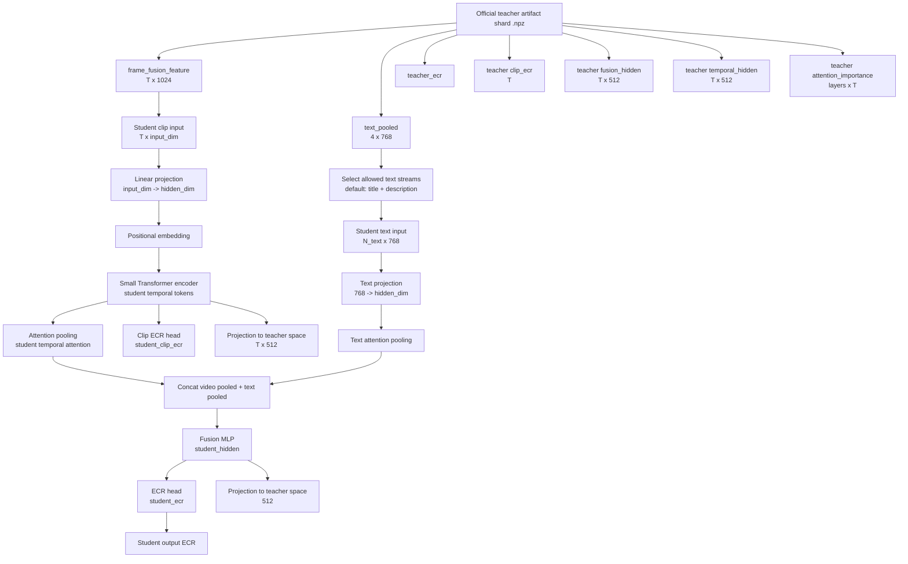

# Student Baseline And Artifact KD

This document describes the student setup that will be trained after the
official 5000-video teacher artifacts are fully synced locally.

The student does **not** reimplement the official teacher. It uses a reduced
feature set and learns from the teacher's predictions plus internal artifacts.

## Student Input Presets

The default thesis student uses:

```text
visual_text:
- frame_fusion_feature from official visual branches
- title text pooled embedding
- description text pooled embedding
```

Other supported presets:

```text
visual_only:
- frame_fusion_feature only

visual_text_action:
- frame_fusion_feature
- ResNet3D action feature
- title text pooled embedding
- description text pooled embedding

visual_text_sound:
- frame_fusion_feature
- sound text pooled embedding
- title text pooled embedding
- description text pooled embedding

privileged:
- frame_fusion_feature
- ResNet3D action feature
- mPLUG caption feature
- sound/title/description/caption text pooled embeddings
```

Use `visual_text` as the main thesis student. Treat `privileged` as an ablation
or upper-bound student, not as the main lightweight student.

## Architecture



## Baseline Training

The baseline uses the same student architecture and same input preset, but only
learns from ground-truth ECR:

```text
loss_baseline = MSE(student_ecr, true_ecr)
```

## KD Training

The KD student uses the same architecture and same inputs, but also imitates the
official teacher artifacts:

```text
loss_kd =
  hard_ecr      * MSE(student_ecr, true_ecr)
+ soft_ecr      * MSE(student_ecr, teacher_ecr)
+ clip_ecr      * MSE(student_clip_ecr, teacher_clip_ecr)
+ temporal      * MSE(project(student_temporal), teacher_temporal_hidden)
+ fusion        * MSE(project(student_hidden), mean(teacher_fusion_hidden))
+ attention     * KL(student_temporal_attention, teacher_attention_importance)
```

Default weights in `scripts/train_official_student_kd.py`:

```text
hard_ecr:        1.0
soft_ecr:        0.5
clip_ecr:        0.2
temporal_hidden: 0.2
fusion_hidden:   0.1
attention:       0.05
```

## Training Command

After syncing the full GCloud teacher output:

```bash
python scripts/train_official_student_kd.py \
  --artifact-dir results/original_snapugc_official_balanced_5000_artifacts_g2_32/teacher_artifacts \
  --labels-csv data/train_subset_balanced_5000.csv \
  --save-dir results/official_student_kd_5000_visual_text \
  --input-preset visual_text \
  --device cuda \
  --epochs 80 \
  --batch 32 \
  --hidden-dim 128 \
  --max-clips 16
```

For CPU smoke tests:

```bash
python scripts/train_official_student_kd.py \
  --artifact-dir /tmp/snapugc_synthetic_teacher_artifacts \
  --labels-csv /tmp/snapugc_synthetic_teacher_artifacts/labels.csv \
  --save-dir /tmp/snapugc_student_smoke \
  --device cpu \
  --epochs 2 \
  --batch 4 \
  --eval-batch 8
```
