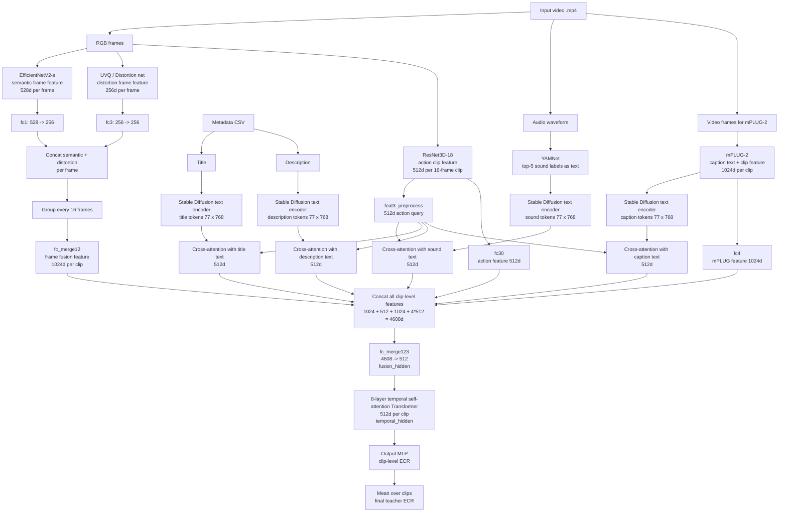

# Official SnapUGC Teacher Source

This directory vendors the official teacher inference architecture used for the
current 5000-video thesis run.

Source repository:

```text
https://github.com/dasongli1/SnapUGC_Engagement.git
```

Pinned commit:

```text
4e0ce3154225cfdf1d036e5b8b1d3874615a04f7
```

Only `ECR_inference/` is kept here. Sample videos, validation CSVs, generated
submissions, and checkpoints are intentionally excluded. Required checkpoints
remain external data and should live under `checkpoints/`, Kaggle input, or the
GCloud checkpoint directory.

The key teacher architecture files are:

```text
ECR_inference/modules/EVQA.py
ECR_inference/test_SnapUGC_baseline.py
ECR_inference/modules/efficientnet_v2.py
ECR_inference/modules/distort.py
ECR_inference/modules/resnet3d.py
ECR_inference/mPLUG_2/models/model_video_caption_mplug2.py
ECR_inference/mPLUG_2/models/visual_transformers.py
```

Runtime scripts may patch a working copy for modern PyTorch/Transformers
compatibility and artifact export. Treat this vendored copy as the clean
reference for what the paper teacher architecture actually is.

## Teacher Architecture

This is the official released EVQA teacher path used by the current GCloud
5000-video run.



### Inputs

```text
Video:
- RGB frames
- audio waveform
- video frames for mPLUG-2

Metadata:
- Title
- Description
```

### Heavy Feature Extractors

```text
EfficientNetV2-s:
  semantic visual feature, 528d/frame

Distortion / UVQ-style network:
  distortion feature, 256d/frame

ResNet3D-18:
  action/motion feature, 512d/clip

mPLUG-2:
  generated caption text
  mid-layer video feature, 1024d/clip

YAMNet:
  top-5 sound classes, converted to text

Stable Diffusion text encoder:
  encodes sound/title/description/caption into 77 x 768 tokens
```

### EVQA Fusion

```text
semantic + distortion -> frame fusion
action feature -> query for text cross-attention
mPLUG feature -> visual-language clip feature
sound/title/description/caption -> text tokens

all clip-level features concat -> 4608d
4608d -> fusion MLP -> 512d
512d clip sequence -> 8 Transformer blocks
Transformer output -> MLP -> ECR per clip
mean clip ECR -> final ECR
```

### Exported Artifacts For KD

When `SNAPUGC_EXPORT_ARTIFACTS=1`, the local wrapper patches a working copy to
save these additional tensors without changing scalar predictions:

```text
- teacher_ecr
- clip_ecr
- fusion_hidden
- temporal_hidden
- caption_feature
- action_feature
- frame_fusion_feature
- text_tokens
- text_pooled
- attention_mean
- attention_importance
```

### DOVER Note

The paper text discusses aesthetic features from DOVER, but the released
`ECR_inference/test_SnapUGC_baseline.py` script and `EVQA.forward` used here do
not load DOVER and do not expose `technical` or `aesthetic` score inputs. The
current run therefore reproduces the official released teacher inference code,
not a custom DOVER-augmented extension.
